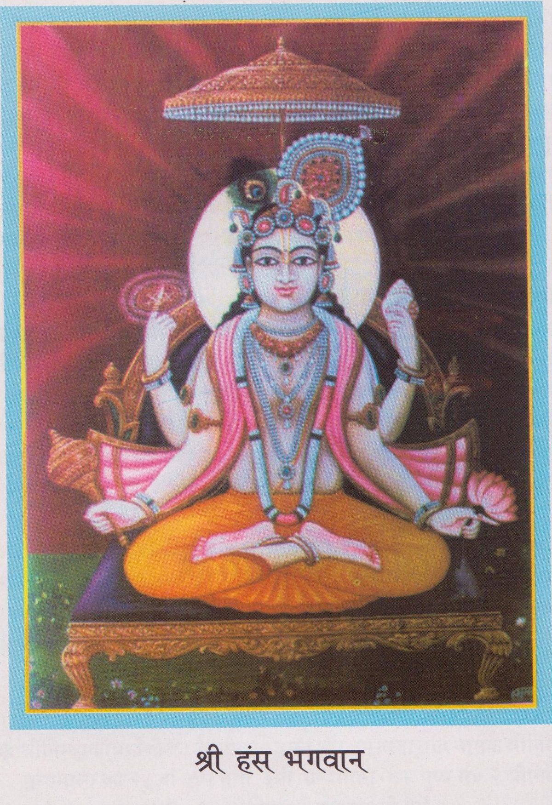

# An introduction to Nimbark Sampraday

**Jai Jai Sri Shyaama Shyaam **

Though the Nimbark sampraday is a very large and well established, they have thousands of ashrams and millions of followers. There is still a lot of misunderstandings and mysteries that surround the Nimbark sampraday. Also it is very difficult to find information online about the sampraday and some of that information is biased and inaccurate. Even from my interactions with devotees, I'v heard many strange concepts such as Nimbark sampraday originally worshipping Rukmini and Krishna and only later worshipping Radha and Krishna. Therefor I am writing this article to straiten out some facts about the  sampraday from the perspective of the Nimbark sampraday and also to share more information about the sampraday as per the request of devotees who are curious to learn more.

## History
Due the the destruction of Mathura and Vrindavan in the 13th Century and 14th Century, some of the history and important scriptures of the Nimbark sampraday has been lost.

The Nimbark sampraday is one of the most ancient sampradays. The Sampraday originates from Śrī Hansa Bhagavān to Sri Sankadi bhagwan (one of the Four Kumaras), who passed it to Sri Narada Muni; and then on to Sri Nimbarka Acharya ji. 

According to tradition, Narada Muni initiated Śrī Nimbārkācārya into the sacred 18-syllabled Śrī Gopāla Mantra, and introduced him to the philosophy of the Yugala upāsana, the devotional worship of the divine couple Śrī Rādhā Kṛṣṇa. 

Sri Nimbarkacharya appeared in different ages. It is mentioned in Acharya Charitra, Naimisha Khanda, Vamana Purana and Bhavishya Purana Once the devotees prayed to the Lord to protect them and the religious path. Then the Lord told His Sudershan Chakra,
```
sudarshana! mahabaho! koti-surya-sama-prabhah
ajnana timirandhanam vishnor margam pradarshaya
```
_"O supreme invincible one! Powerful like millions of suns. O My supreme devotee. Show the path of Vishnu, the devotional path, to these people who are suffering in darkness due to ignorance."_

There are some scholars that claim that Sri Nimbark Acarya Ji appeared around the same time or before the appearance of Shankaracharya ji, but we do not accept this. As per the oral tradition and different Puranic evidence's, one main sources being the Bhavishya Purana, it is clearly stated that Nimbark Acarya incarnated more than 5000 years ago and explains more details about the divine appearance of Sri Nimbark Acaryaji.

Then Sudarshana Chakra decided to take his incarnation by the order of the Lord. He advented himself in the beginning of kali yuga, from today 5094 years ago, in the East-South part of India on the bank of the Godavari river near the city of Vaidurya Pattan at Sudarshana Ashrama in the womb of Sadhvi Jayanti Devi, the wife of Aruna Rishi, who was in the dynasty of Bhrigu at dusk during the karttika month, Shukla Purnima. In his childhood he went on a pilgrimage with his parents and reached Vraja mandala. He performed austerities under Goverdhan hill in a village named Nimbagaon and showed the path of devotion to Radha and Krishna. Once Brahma came in the form of a renunciate in order to take the darshan of Sudarshana who was there as a small boy. Sudarshana wanted to give honour to Brahma. He showed him the darshan of Surya from the middle of a neem tree, though it was already sunset. When Brahma understood that the Lord in the form of Surya gave his darshan through a neem tree, he said, "You will be famous by the name of "Nimbarka" and disappeared.




## Philosophy

Sri Nimbark Acaryaji is the sampraday acharya and established the siddhanta known as `Dvaita Advaita` also known as `Bhedabheda`, `Dualistic Non-Dualism`. The jiva(individual soul) is simultaneously one and different to Brahman(Supreme soul) and to jagat/prakriti (material universe/matter).

They follow the teachings of Srimad Bhagavatam and of Sri Nimbark Acharyaji, which state that the worship of Sri Vishnu and His forms are supreme, Thus classifying the Nimbark sampraday as a Vaishnav sampraday. But the only form of Hari that they worship is Radha and Krishna. 

```
radhaya sahito devo madhvo vaishavottamaih
archyo bandyashcha dhyeyashcha shrinimbarkapadanugaih
- Shri Nimbarka-Sudha  
```

_"For the followers of Shri Nimbarkacharya the only worshipable Shri Radha along with Madhava, Shri Shri Radha Rasik Bihari is the only deity which should be worshipped, which should be prayed to and upon which we should meditate. This is the only goal which is universally accepted by all. In the end, offering respectful obeisances to the lotus feet of all the Devacharyas of the guru parampara and known and unknown Vaishnavas we pray at their holy feet."_

Sri Nimbark Acaryaji worshipped Radha along with Krishna in Sakhi Bhava Upasana method of worship and has been maintained through the parampara up until this very present day. There is no superiority between Radha and Krishna, both are Bhagavaan(God). They are simultaneously one and separate, dvaita advaita. 

```
ange tu vaame vrishabhaanujaam mudaa viraajamaanaam anuruupasaubhagaam. sakhiisahasraih parisevitaam sadaa smarema deviim sakalestakaamadaam. 
- Vedanta Kamadhenu Dashashloki, Verse 6, By Sri Nimbark Acaryaji
```

*The left portion of the body of the Supreme Lord is Shri Radha, seated blissfully, as beautiful as the Lord Himself; who is served by thousands of gopis: we meditate on the Supreme Goddess, the fulfiller of all desires.*

```
radhaamkrsnasvaroopaam vai, krishnam raadhaasvarupinam; kalaatmaanam nikunjastham gururoopam sadaa bhaje - Maha vani
```

_I ceaselessly praise Radha who is none other than Krishna, and Sri Krishna who is none other than Radha, whose unity is represented by the Kaamabeeja and who are forever resident in Nikunja Goloka Vrndavana._

A lot of this may sound familiar as most people are already acquainted with the famous Hare Krishna movement or Gaudiya Vaishnavism. As one can see there are striking similarities between the Gaudiya's and Nimbarki's. They share many identical concepts such bhakti, tattva's and the worship of Radha Krishna. Therefor a lot of this knowledge is transferable between the sampradays. And ofcourse there are some differences one being that in Nimbark leela, Radha and Krishna are married to each other.

## Practice/Sadhana
Archana, karma yoga, different types of dhyaana, gyaana, etc are all included in Nimbark sampraday. But the tradition has strong emphasis on naam japa and this is the main sadhana.

They chant the `Yugal maha mantra` or `Radha Krishna maha mantra`: 
 
*Radhe Krishna Radhe Krishna 
Krishna Krishna Radhe Radhe, 
Radhe Shyaam Radhe Shyaam 
Shyaam Shyaam Radhe Radhe*

This used to be a secret mantra in the sampraday, but it has now been wide spread and chanted by all.

Sri Nimbark Acaryaji as well as Sri Hari Vyas Dev Acaryaji have also given very special importance to the name and worship of Radharani. Therefor you will find many Nimbarki's also chanting `Radhe Radhe` as well.

One of the type of Dhyaana that the Nimbarki's perform dhyaan they meditate focusing between their eyebrows or on their bindi, meditating on Radha Krishna, the yog pit (a mandala where Radha and Krishna and the sakhi's live) and or lila. 

The name, form, qualities and past times of Sri Sri Radha Krishna are seen to be non different from each other. Therefor Dhyaan, Naam Jaap, Srimad Bhagavatam and Maha Vani Gayaan(Chanting) are all the same.

## Moksha
The type of moksha that is desired in the Nimbark sampraday is to attain an eternal spiritaul body, become the servant of Sri Yugal Sarkar(Radha Krishna) and to reside with them in their eternal abode `Sri Vrindavan Dham`. 

It is a state of awareness of full identity with the divine couple Sri Sri Radha Krishna.

## Saints
One of the most important Acarya's in the sampraday is `Sri Hari Vyas Deva Acharyaji` who appeared some where around the 14th century. He wrote a highly confidential and extremely important book in the sampraday called `Maha Vani`, which deals with the intimate past times of Radha Krishna in Vrindavan Dham. But due to its confidential nature not all Nimbarki's read this book, as one needs qualification to deal with its high subject matter or some Nimbark tyagi's choose to rather focus more on tapasya, naam jap and dhyaan.

Other very well know saints that come from the Nimbark sampraday is `Jayadev Goswami` who wrote `Gita Govinda` and `Swami Haridas` who founded the `Haridas sampraday`.

`Swami Sri Sribhatta`, the elder god-brother of Jayadeva composed the `Yugala Shataka` around 1294 CE for the Dhrupada style of musical presentation like Jayadeva, however unlike Jayadeva who composed his work in Sanskrit, Swami Shribhatta’s compositions are in Vraja Bhasha, a Hindi vernacular which was understood by all inhabitants of Vraja.

## Branches
Within the Nimbark sampraday their is a recent branch who's members receive the title `Kathia baba` in their name's. The saints were called Kathia Baba Maharaj by the common people due to the very unique thick wooden belt (kath) and white piece of cloth (kaupin) worn by them which indicated their renunciation of all bodily pleasures.
  
The Kathia Baba's originally come from the Himalayas. This has influenced this branch with different practices of tapasya and a strong emphasis on vairagya. They normally have long dread locks and wear a thick wooden belt.

The first Kathia Baba that come down from the Himalayas and started spreading the Kathia baba branch was Sri Ram Das Kathia Baba(24 July 1800 - 8 February 1909). The Ishta dev, paramapara, diksha mantras, tilak, scriptures are all the same, and this is not seen as a separate branch, but it is seen as apart of the Nimbark sampraday.

## Tilak
The tilak of the Nimbark sampraday can mean two or more things:
1. The yellow line represents a mandir, and the bindi represents a murti of Sri Sri Radha Krishna.

2. The yellow outline represents Sriji's(Radha's) charan(Lotus feet) and the black bindi between the eye brows represents Krishna or the yog pit, a mandala where Radha and Krishna and the Sahecharis live. 

## Nimbark Tyagi's
The renunciates in Nimbark sampraday are known as tyagi's. They do not wear safforn, they where a white dhoti with no pleat and white shol.

## Scripture's
Their are many different scriptures, but the main scriptures that are focused on are: `Bhagavad Gita`, `Srimad Bhagavatam`, `Bhakta Maal` and the rasiks recite `Maha Vani`.

There are some scholarly Nimbark ashrams that Study Sanskrit, Vedanta and Nimbarkji's scriptures. But those ashrams are few.

Nimbark Acarya has written the following scriptures and commentaries:
```
Vedānta Pārijāta Saurabha– Commentary on the Brahma Sutras
Sadācāra Prakāśa– Commentary on the Bhagavad-Gītā
Rahasya Ṣoḍaśī- Śrī Gopāla Mantra explained
Prapanna Kalpa Vallī- Śrī Mukuṇḍa Mantra explained
Prapatti Cintāmaṇi – On Supreme surrender
Prātaḥ Smaraṇa Stotram
Daśa Śloki or Kāmadhenu– Ten Verses
Saviśeṣa Nirviśeṣa
Śrī Kṛṣṇa Stavam
```
 
## Resources:

[The life and teachings of Shri Nimbarka Acharya](https://www.hinduismtoday.com/educational-resources/the-life-teachings-of-one-of-indias-great-luminaries-shri-nimbarka/)
[Nimbark philosophy](http://shrijagatgurunimbarkacharyapeeth.org/index_files/philosophy.htm)
[An introduction to Nimbark sampraday](https://hi-in.facebook.com/TheGloriousBangioNimbarSamprodoyAshram/posts/shri-radhejai-jagat-guru-shri-nimbarka-achraya-juthe-universal-tradition-of-the-/2460105870717820/)
[Nimbark sampraday - divine life soceity](https://www.dlshq.org/saints/nimbarka/)
[Nimbark Wiki](https://vedanta.redzambala.com/traditions/nimbarka-sampradaya-nimbarka.html)


## The End

```
vanchha kalpatarubhyashcha kripa sindhubhya eva cha
patitanam pavanebhyo vaishnavebhyo namo namah
```

