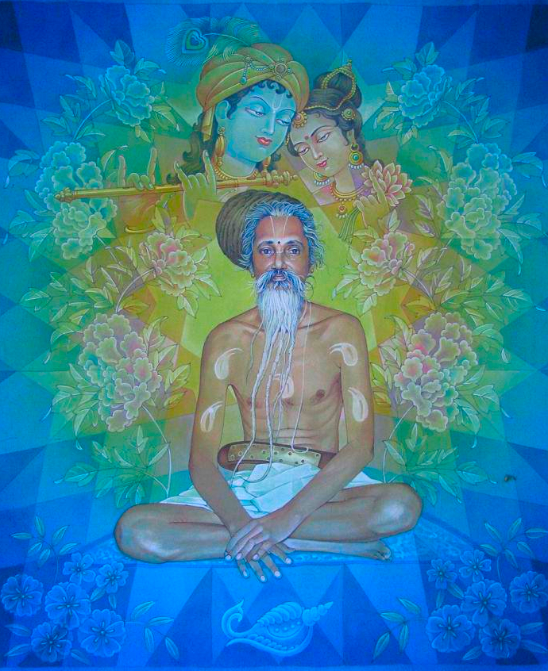

# An introduction to Nimbark Sampraday


**Shri Radha Sarveshwari Vijayate**

## Introduction

_This article is work in progress..._

The Sampraday also has is known by the following names: *Hamsa*, *Catuhsana*, *Kumara* or *Sanat* *sampradaya*

There are a lot of mysteries that surround the Nimbark sampraday. With very little information available online and very few books available in english, the sampraday may be difficult for people living outside of India to learn about. This article is an attempt to share a brief overview of the Nimbark sampraday from the perspective of the tradition.

There has been quiet a bit of historical work done on the Nimbark sampraday, but it has no where received the same amount of attention as other sampradays due the sampraday not having the same expansive textual traditions, vast infrastructure and buildings.

In north India the Nimbark sampraday is highly respected and has major titles within the sadhu samaj of the Kumba Meela and Vrindavan. Even though the tradition has a large amount of magnanimous saints and spiritual masters, the sampraday has never been in the mainstream view and always had a humble approach towards how it presents itself. 

The sampraday has also given major contributions to India's rich culture and heritage, and it's a treasure chest filled with many more jewels for indologists to discover.


## Origin


The Sampraday originates from Śrī Hansa Bhagavān to Shri Sankadi Bhagavān (The Four Kumaras), who passed it to their younger brother Shri Narada Muni; and then on to Shri Nimbarka Acharya ji. 

According to tradition, Narada Muni initiated Śrī Nimbārk ācārya into the sacred 18-syllabled Śrī Gopāla Mantra, and introduced him to the philosophy of the Yugala upāsana, the devotional worship of the divine couple Śrī Rādhā Kṛṣṇa. 


## History

Please see [History and Nimbark Acharyas](./history_and_nimbark_acharyas.md).


## Philosophy


The Sutras of Maharishi Veda Vyasa form the basis of Vedanta and has a large body of sacred texts. These sutras describe different aspects of the Absolute and as a result various interpretations and schools of thought emerged, such as: Keval Advaita of Sri Sankaracharya, Visishta Advaita of Sri Ramanujacharya, Dvaita of Sri Madhavacharya, etc.  

Shri Nimbark Acharyaji established the siddhanta(philosophy) known as `Svabhavika Bhedabheda` `(Natural difference and non-difference)` or `Dvaitadvaita` `(Dualistic Non-Dualism)`.

### svābhāvika-dvaitādvaita


1. The totality of the śrutis propounding difference and non-difference are equally authoritative.

2. Difference and non-difference are both real and exist in all states of existence.

3. Brahman is the singular efficient and material cause of the universe. The example of a spider and its web is given.

4. The individual soul is an agent, enjoyer, possessed of knowership (jñātṛtvavat), plural, and infinite in number.

5. The individual soul is eternal, a portion and transformation of Brahman, and immutable.

6. The universe beginningless.

7. Liberation is attaining a similar state as Brahman.

8. Attaining Brahman in this life is called inferior liberation, which conforms to jīvanmuktī (liberation in this life). Another term for this is emancipation (apavarga). In reality it is caused by detachment from the material world. Because of not leaving the body, the individual soul cannot be absorbed into Brahman; however when the soul does eventually leave the body it enters a second type of liberation – supreme liberation, which is called attaining a similar nature as Brahman (brahmabhāvāpatti).

9. Brahman transforms into three main states: The Supreme-Soul-state, the state of the individual soul, and the state of form and formlessness (the jagat), termed ‘rāśi’.

10. Due to being the pervader and pervadable, the foundation and its dependent, having its state and actions dependent on it, mutual interdependence and other causes, difference and non-difference exists in in a singular substratum without any contradiction.

This philosophy has been able to reconcile all other schools of thought and the so called contradictory statements of the Vedas. Bhedadheda means that the jiva(individual soul) is simultaneously one and different to Brahman(Supreme soul) and to jagat/prakriti (material universe/matter).

According to Shri Nimbark Acharya, the relation between Brahman and the jiva is like a tree and its branches. The branches have all qualities of the tree, but the branches are not the tree as a whole. Likewise jiva is anu (small) having all qualities like Brahman(bibhu-large), but with limited extent. Brahman resides in the heart of jiva, but jiva has no realization due to Maya (illusion). This is the basic idea of `Dvaitadvaita` siddhanta.

While the material universe is not seen as the highest reality, it is also not seen as an illusion and is accepted as real. The jiva(individual soul) who is trapped in samsara or this lower dimention of reality which filled with all sorts of misseries needs to utilizie his/her conciousness in awakening his/her divine relation with Supreme Godhead in order to transcend this mundane reality.

Here is a detailed explanation of `Dvaita Advaita`: [Nimbark philosophy](http://shrijagatgurunimbarkacharyapeeth.org/index_files/philosophy.htm)

The tradition follows the philosophy of Shrimad Bhagavatam and of Shri Nimbark Acharya ji, which state that the worship of Shri Vishnu and his forms is the highest form of worship, thus classifying the Nimbark sampraday as a Vaishnav sampraday. 

But Shri Nimbark Acharya specifically states:

```
radhaya sahito devo madhvo vaishavottamaih
archyo bandyashcha dhyeyashcha shrinimbarkapadanugaih
- Shri Nimbarka-Sudha

For the followers of Shri Nimark Acharya they should only worship Shri Radha along with Madhava, Shri Shri Radha Rasik Bihari is the only deity which should be worshipped, which should be prayed to and upon which we should meditate. This is the only goal which is universally accepted by all. 
```

Shri Nimbark Acharya held the view that there is no superiority between Radha and Krishna, both are God (Parabrahman). 

Even though Shri Nimbark Acharya ji was a vaishnava vedantist and incarnated with the purpose to spread the worship of Radha Krishna for the general masses, He has different moods and multiple spiritual identities other than being an avatar of Shri Sudarshan Chakra. His inner mood was that of sakhi bhava upasana, which is a very high level and esoteric form of worship which is not suitable for the general public, this style of worship has also been maintained through the parampara up until this very present day.

```
Ange Tu Vame Vrishbhanujam Muda, Virajmanamnurup Saubhgaam
Sakhisahastrai Parisevitam Sada, Samrem Devim Sakaleshtkam
- Jagadguru Nimbarkacharya, Shri Vedanta Dashasloki (05)

The left portion of the body of the Supreme Lord is Shri Radha, seated blissfully, as beautiful as the Lord Himself; who is served by thousands of sakhis. We meditate on the Supreme Goddess, the fulfiller of all desires.
```

```
radhaamkrsnasvaroopaam vai, krishnam raadhaasvarupinam; kalaatmaanam nikunjastham gururoopam sadaa bhaje
- Maha vani

I ceaselessly praise Radha who is none other than Krishna, and Shri Krishna who is none other than Radha, whose unity is represented by the Kaamabeeja and who are forever resident in Nikunja Goloka Vrndavana.
```

A lot of this may sound familiar if one is already acquainted with Gaudiya Vaishnavism. As one can see there are many similarities between the Gaudiya's and Nimbarki's. They share identical and simalar concepts such as bhedabheda, importance of Srimad Bhagavatam, bhakti, naam jaap, tattva's, moksha and the worship of Radha and Krishna. Therefor a lot of knowledge is transferable between the sampradays. And of course there are differences as well, one example is that in the Nimbark leela as described in Mahavani, Radha and Krishna are married to each other and do not experience any major types of separation from each other. But the two sampradays have more things in common than in difference.


## Practice/Sadhana

Here are the 5 limbs of the sadhana that is performed within the tradition:
1. Karma (ritual action)

Performed conscientiously in a proper spirit, with one's varna and asrama (phase of life) thereby giving rise to knowledge which is a means to salvation).

2. Vidyā (knowledge)

Not as a subordinate factor of karma, but also not as an independent means for everyone; only for those inclined to spending vast lengths of time in scriptural study and reflection on deeper meanings.

3. Upāsanā or dhyāna (meditation)

This is again not an independent means to Salvation for all, as only those qualified to perform the upasana (with Yajnopavitam) can perform this Sadhana.


4. Prapatti (surrender to the Lord/devotion)

Devotion and self-surrender to God as Shri Radha Krsna. This method of attaining Salvation, known as Prapatti Sadhana, contains elements of all the other means, and is most importantly, available to all. Men, women, all classes and castes (or non-castes) are permitted to seek liberation through this, **the most important Sadhana**. It is referred to as Sadhana (or Apara) Bhakti – devotion through regulations. This in turn leads to Para Bhakti – the highest devotion characterised by Madhurya Rasa – the sweet emotions of devotion experienced by those perfected in Sadhana Bhakti.

- **Naam Japa** the chanting the Holy Names is also extremely important.

Nimbark sampraday's maha mantra is called the `Yugal maha mantra` or `Radha Krishna maha mantra`: 
 
```
Rādhe Kṛṣṇa Rādhe Kṛṣṇa
Kṛṣṇa Kṛṣṇa Rādhe Rādhe
Rādhe Shyām Rādhe Shyām
Shyām Shyām Rādhe Rādhe
```

```
The most important factor in this Age of Kali, which is an ocean of faults, is that one can be free from all contamination and become eligible to enter the kingdom of God simply by chanting the holy names. The self-realization that was achieved in the Satya millennium by meditation, in the Treta millennium by the performance of different sacrifices, and in the Dvapara millennium by worship of Lord Krsna can be achieved in the Age of Kali simply by chanting the holy names. - Srimad Bhagavatam (12.3.51-2)
```

The perfection of naam japa is roop dhyaan, This is an very advanced practise.

5. Gurupasatti (devotion and self-surrender to God as Śrī Rādhā Kṛṣṇa)

Devotion and self-surrender to guru. Best realised as a part in Prapatti, and not as an independent means, although it can be so.


## Moksha (Liberation) 

The jiva(individual soul) is covered in beginingless ignorance and is trapped in the material world, suffering all kinds of meseries such as duality, birth, death, disease, old age, etc.

Salvation is attained by real knowledge (Jnana) and true devotion (Bhakti). Real knowledge reveals the true nature of the all-pervading Brahman. True devotion leads to total self-surrender to the Lord. The individual soul retains its individuality with reference to divine enjoyment (Bhoga-samyatvam), but its will is subservient to that of Brahman. The individuality of the soul is not dissolved even in the state of Moksha or the final emancipation. Even in the state of release, the individual soul is different from, as well as identical with, Brahman. This is identity with difference, Bheda-abheda

It is released from its previous state of bondage. It abides now in the glory of its own true Self which is Brahman Itself. It is in full awareness or consciousness of being one with the Lord. It will not return to the world. It is freed from the round of births and deaths.

There are different types of liberation. Such as the jiva merging into brahman, where the jiva is in a nirguna(devoid of all characteristics and qualities) state situated in bliss.

### What happens when one liberated ?

1. Attaining the qualities of Shri Krishna

 The jiva(individual soul) posses the qualities of Bhagavaan, but never has the power over creation, preservation and dissolution of the world. The Jiva is also subject to being overpowerd by maya if it has not attained knowledge of Para Brahman. The difference between jiva and Bhagavaan(God) is not in kind, but in degree.

2. Residency in Vrindavan Dham

The type of liberation that is focused on within the Nimbark sampraday is to attain residency in the eternal spiritual realm called Vrindavan. 

Those who enter in this realm, go there with a new spiritual body and identity. One is in a state of awareness of full individual identity and simultatous oneness with the divine couple Shri Radha Krishna. With ones eternal spiritual body one also has a specific relationship with Radha and Krishna, such as becoming a servant, friend, parent, with Shri Yugal Sarkar(Radha Krishna) or a lover of Krishna.

One may attain liberation in this life or when one leaves ones physical body.

### How to attain Moksha (Liberation)

One attains liberation or residency only by attaining prem (divine love) for Radha and Krishna. Attaining prem (love of God) is ultimately only possible through grace. Even though grace is causeless, the devotee has to make an effort from his side as well, its works both ways. The devotee has to do his utmost best to please his Guru and follow the instuctions given in the Vedic literature and peform his daily spiritual practises. 


### Descriptions of Vrindavan

There is no such thing as illusion, old age, diseases, scarcity or envy in Vrindavan. Every single soul that resides there is a perfected being with the same nature and qualities as Shri Krishna Himself.

Even though all events happen in a sequintial manner, time does not exist in this realm and one moment could be even billions of years. 

Vrindavan dhams beauty and splendour is beyond words, everything including the inanimate objects is concious and luminous. When the gem studded golden path ways radiance blends with the reflection of the self luminous plants, it creates a holographic duplication of the plants, these holograms looks so real that the deers think they are real plants and try to eat them ! Any fruit tree can supply one with every single kind of fruit imaginable and these fruits are unlike the fruits in the material realm, they are always fresh, visually appealing, ripe, fragrant, delicious and have different kinds of flavours that we dont even know of ! There are enchanting fountains pouring out rare gems instead of water. In and around the palace where the Radha and Krishna live are peacocks, parrots, deers, flower gardens, groves, forests, the yamuna river and natural vedic architected ponds.

In Vrindavan the only goal of life is to love, serve, play and live a life centered around pleasing the divine couple. All the activities performed and ever fresh and increase with bliss, nothing including bliss is ever exhausted or reaches a saturation point.

-----

## Branches of Shri Nimbark sampraday

There are 12 main branches or lineages from the Nimbark sampraday are originating from the 35th Acharya Shri Harivyas Dev Acharya's 12 main disciples, maybe 5 or 6 of these branches are still alive today. There may be other branches such as Shri Haridas Sampraday, which are not connected to Shri Harivyas Dev Acharya that are still alive.

The two most promiment branches today connecting to Shri Harivyas Dev Acharya are:
- `Shri Parashuramdevacharya Ji (36th)` -  Acharya Peeth branch. 

About 35 important temples located at Vrindavan, Ajmer, Kishangad, Indore, Sholapur, Nagpur, Amravati, Nagore and Moongi paitan among other places all over india are under the tutelage of the Shri Nimbark Acharya Peeth and follow the systems and traditions of the sampraday. It also have more than a dozen of non profit instutions which consists of schools, unviversities, hostels, goshalas, libraries, printing press, medical dispensary, etc.

- `Svāmī Svabhūrāma Devācārya(36th)` - Which is connected to `Shri Indra Dasji Kathia Babaji Maharaj(50th)` the first Nimbarki in this line to receive the title `Kathia baba`

I would guess that there are more than 20 Kathia Baba temples in Vrindavan, Haridvar, Puri, Dvarka, Ashok Nagar, Guwahati, Tinsukia, Siliguri, Lona Chamiyari, Kolkatta, Madya Pradesh, Kashi, and other areas in north India. And they also have additional charity instututions such as healthcare, libraries, schools, etc.

- Other branches - They have numerous amounts of temples including large ones in different areas of North India and charity institutions.

The sampraday operates in a decentrilized manner and the temple(s) is run according to the standard and style of the present Mahant. Even though the temple(s) under a certain Mahant and are independant, the unity between all the Nimbarki's is astounding.


---- 



**Kathia baba's**

The saints were called Kathia Baba Maharaj by the common people due to the very unique thick wooden belt (kath) and white piece of cloth (kaupin) worn by them which indicated their renunciation of all bodily pleasures. Matting the hair in dreadlocks (jata) is apart of the tradition.

The Kathia baba's used to practise in seclusion in the himalays, but the first Kathia Baba that come down from the Himalayas and popularised this branch was `Shri Ram Das Kathia Baba(54th)`. 


## Tilak
The tilak of the Nimbark sampraday can mean two or more things:

1. The yellow line represents a mandir, and the bindi represents the murti of Shri Shri Radha Krishna or the yog pit, a mandala where Radha Krishna and the Sahecharis live. 

2. The yelow outline represents Shriji's(Radha's) charan(Lotus feet) and the black bindi between the eye brows represents Krishna.

## Sannyasi or Babaji
The renunciates in Nimbark sampraday are known as babaji's. They do not wear saffron, they mostly wear a white dhoti with no pleat and white shaul, sometimes yellow may also where yellow colored cloth.

## Scripture's
The main scriptures that are focused on by general devotees and sadhus are: `Bhagavad Gita`, `Shrimad Bhagavatam` and `Bhakta Maal`. 

And the rasiks recite and focus on Radha Krishnas confidential Lila books: `Yugal Satak` and `Maha Vani`.

The scholars study all the main upanishads, vedas, puranas, ithiasas, etc and Nimbarki bhayas and other works that are available..

## Online Resources:
- [The life and teachings of Shri Nimbarka Acharya](https://www.hinduismtoday.com/educational-resources/the-life-teachings-of-one-of-indias-great-luminaries-shri-nimbarka/)

- [Nimbark philosophy](http://shrijagatgurunimbarkacharyapeeth.org/index_files/philosophy.htm)

- [Nimbark parampara](https://nimbarka.wordpress.com/shri-nimbarka-sampradaya/2008/shri-acharya-parampara-the-guru-disciple-lineage/)

- [Nimbark sampraday](https://nimbarka.wordpress.com/shri-nimbarka-sampradaya/)

- [An introduction to Nimbark sampraday](https://hi-in.facebook.com/TheGloriousBangioNimbarSamprodoyAshram/posts/shri-radhejai-jagat-guru-shri-nimbarka-achraya-juthe-universal-tradition-of-the-/2460105870717820/)
- [Nimbark sampraday - divine life soceity](https://www.dlshq.org/saints/nimbarka/)

- [Nimbark Wiki](https://vedanta.redzambala.com/traditions/nimbarka-sampradaya-nimbarka.html)

- [Nimbark Parikar](https://nimbarkparikar.blogspot.com/)

- [Brief History of Nimbark Sampraday](https://www.liquisearch.com/radha_krishna/nimbarka_sampradaya)

- [Nimbark darshan](https://spiritualdarshan.in/)

## Books and papers
- [Nimbark Parijata Saurbha Vol III - Roma Bose](https://archive.org/details/in.ernet.dli.2015.188129)

- [Rādhā-Kṛṣṇa’s Vedāntic Debut - Vijay Ramrance - 2015](https://era.ed.ac.uk/bitstream/handle/1842/26018/Ramnarace2015.pdf)

## The End

_vanchha kalpatarubhyashcha kripa sindhubhya eva cha
patitanam pavanebhyo vaishnavebhyo namo namah_