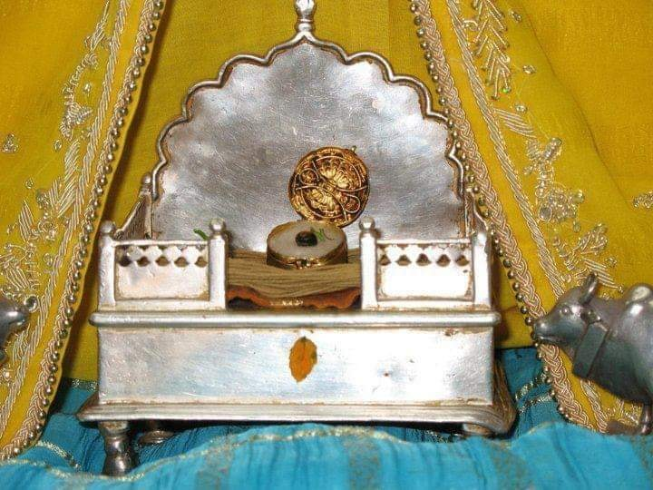

# An introduction to Nimbark Sampraday


**Shri Radha Sarveshwari Vijayate**

## Introduction

_This article is work in progress..._

The Sampraday also has is known by the following names: *Hamsa*, *Catuhsana*, *Kumara* or *Sanat* *sampradaya*

There are a lot of mysteries that surround the Nimbark sampraday. With very little information available online and very few books available in english, the sampraday may be difficult for people living outside of India to learn about. This article is an attempt to share a brief overview of the Nimbark sampraday from the perspective of the tradition.

There has been quiet a bit of historical work done on the Nimbark sampraday, but it has no where received the same amount of attention as other sampradays due the sampraday not having the same expansive textual traditions, vast infrastructure and buildings.

In north India the Nimbark sampraday is highly respected and has major titles within the sadhu samaj of the Kumba Meela and Vrindavan. Even though the tradition has a large amount of magnanimous saints and spiritual masters, the sampraday has never been in the mainstream view and always had a humble approach towards how it presents itself. 

The sampraday has also given major contributions to India's rich culture and heritage, and it's a treasure chest filled with many more jewels for indologists to discover.


## Origin


The Sampraday originates from Śrī Hansa Bhagavān to Shri Sankadi Bhagavān (The Four Kumaras), who passed it to their younger brother Shri Narada Muni; and then on to Shri Nimbarka Acharya ji. 

According to tradition, Narada Muni initiated Śrī Nimbārk ācārya into the sacred 18-syllabled Śrī Gopāla Mantra, and introduced him to the philosophy of the Yugala upāsana, the devotional worship of the divine couple Śrī Rādhā Kṛṣṇa. 

## History

The Nimbark sampraday is the most ancient living vaishnav sampraday. Though some modern scholars try dispute this due to lack of evidence, but they themselves present many varying timelines all very far apart with very little evidence to support their own claims, which is ironic, because this falls into the same fallacy that they use against the tradition.

Though there are also many other scholars such as Dr. Brahmachari Vrajvihari Sharan, Satyanand Joseph, Prof. Rasik Bihari Joshi, Prof. M. M. Aggrawal, etc . That state that Shri Nimbarks time period to be at least of the same time or before the appearance of Shankaracharya.

Many indologists have underlined the fact that history has not been kind to the Nimbārka Sampradāya. Nevertheless, the tradition has contributed great luminaries to the heritage of Bhārata. Śhrī Jayadeva Kavi (author of the famous Śhrī Gīta Govinda), members of the royal dynasties of Amer, Jaipur, Jodhpur, Merta, Udaipur, Bikaner, Kishangarh, Rupangarh, Bharatpur, Budhiya (Haryana) and others from the 16th century until Indian independence, the great Hindi poets Ghanānanda, Sundar Kuṃvarī, Bāṅkāvatī, Nāgarī Dās, etc., were all followers of monks of the Nimbārka Sampradāya. Nāgarī Dās, the spiritual name of Maharāja Sāvant Singh (born 1699), was the founding patron of the Kishangarh style of painting. Many hundreds of poems he composed after renouncing, dedicated to the Supreme Lord, are sung not only by Nimbārkīs, but also by followers of the Puṣhṭimārga (Śhrī Vallabhāchārya’s sampradāya). These are a small sample of those who credit their talents to the blessings of the Supreme Lord and the gurus of the Nimbārka Sampradāya.

Nimbārkī monks prefer to worship the Lord in seclusion. They typify the true paramahaṁsa, which is why the tradition is also known as the Paramahaṁsa Sampradāya, the lineage of the supremely renounced. Also especially in the early days, the esoteric knowledge of Shri Radha and the Yugal maha mantra was kept secret. This lead to the sampraday slowly diminishing and towards the 15th century it was almost lost, having a very small following only. But fortunately the sampraday was revived and widespread during the 15th and 16th century by Shri Harivyas dev acharya and his 12 main disciples.

While the sampraday was at its smallest numbers during the 11th till 15th century time period, the destruction of Mathura and Vrindavan occurred multiple times, and unfortunately many important scriptures of the Nimbark sampraday has been lost.

The rest of the history can be found here: [Nimbark Acharyas](./nimbark_acharyas.md).

----



### Shri Sarveshvar Prabu

Amongst the main deities at Nimark Acharya peeth, Sarveshwar Prabhu, in the form of a Shaligram is the most auspicious and is one of a kind deity. As this Shaligram has been worshipped over the ages from the Sanaka brothers, Devarishi Narad, Jagatguru Shri Nimark Acharya and all the following Acharyas of the Nimark Acharya peeth. Wherever the acharyas proceed Sarveshvar Prabhu is always with the Acharya.


---- 


### Thakur Shri Madhav – Gokulchandramaji

The deity `Gokul Chandrama ji` is installed at the Nimbarkpeeth and is mentioned in the `Shri Gopal Tapani Upanishad` of the `Atharva Veda` as an ancient deity that caused realisation of the Shri Gopal mantra. It is said that the fortunate few who obtain the darshan of this beautiful deity even once becomes blessed. The deity has also been worshipped by poet laureate `Shri Jayadev` the author of the famous `Gita Govinda`. 

The history of this deity is as follows:

After a few years after the passing away of `Shri Jayadev`, the idol was installed at Shri Nimark Acharya peeth at Shri Radha Kund, Vrindavan. Shri Govind Sharana Devacharya, the then acharya of the Nimark Acharya peeth, received instructions from Shri Radha Madhav to embark on the acharya’s rath (carriage) with the deity to Salemabad, Rajasthan. As instructed the Acharya proceeded on the rath to Salemabad. Enroute at Bharatpur, the entrouge rested for after seva of pulling the rath, the residents of vraj pleaded with the Acharya not to take away the deity to Salemabad and return to return it to braj. The Acharya explained that it is the instructions of Shri Radha Madhav, therefor he is just as helpless as them. The people approached the ruler of Bharatpur, who told the protestors that if they could pull the rath back to braj and if the Lord is willing, then He had no objections. 

Try as they may, the residents of vraj, could not move the rath even one inch. However, after the seva, when the Acharya, pleaded for the rath to move and asked the devotees to pull to the astonishment of all devotees, the rath moved and proceeded to Salemabad, where the deity is curruntly installed in the temple at the centre of the Nimbark Acharya peeth.


### Related articles
- [Origines of the Ras Lila Tradition](https://a108.net/blogs/entry/15339-karhala-village-origin-of-the-raas-lila-tradition/)

- [Ancient Nimbark temple, 350 - 400 years old](https://a108.net/blogs/entry/38005-nimbark-temples-of-chhipi-gali-nimbark-kot-ajab-manohar-lal/)


## Philosophy


The Sutras of Maharishi Veda Vyasa form the basis of Vedanta and has a large body of sacred texts. These sutras describe different aspects of the Absolute and as a result various interpretations and schools of thought emerged, the four main schools of thought are: The Keval Advaita of Sri Sankaracharya, the Visishta Advaita of Sri Ramanujacharya, the Dvaita philosophy of Sri Madhavacharya and the Bhedabheda or Dvaitadvaita philosophy of Sri Nimbarkacharya.  

Shri Nimbark Acharyaji is the sampraday Acharya and established the siddhanta known as `Svabhavika Bhedabheda` `(Natural difference and non-difference)` or `Dvaitadvaita` `(Dualistic Non-Dualism)`. This philosophy has been able to reconcile and all other schools of thought and contridictory statements in the sutras.

The jiva(individual soul) is simultaneously one and different to Brahman(Supreme soul) and to jagat/prakriti (material universe/matter).

According to Shri Nimbark Acharya, the relation between Brahman and the jiva is like a tree and its branches. The branches have all qualities of the tree, but the branches are not the tree as a whole. Likewise jiva is anu (small) having all qualities like Brahman(bibhu-large), but with limited extent. Brahman resides in the heart of jiva, but jiva has no realization due to Maya (illusion). This is the basic idea of `Dvaitadvaita` siddhanta.

While the material universe is not seen as the highest reality, it is also not seen as an illusion and is accepted as real. The jiva(individual soul) who is trapped in samsara or this lower dimention of reality which filled with all sorts of misseries needs to utilizie his/her conciousness in awakening his/her divine relation with Supreme Godhead in order to transcend this mundane reality.

Here is a detailed explanation of `Dvaita Advaita`: [Nimbark philosophy](http://shrijagatgurunimbarkacharyapeeth.org/index_files/philosophy.htm)

The tradition follows the philosophy of Shrimad Bhagavatam and of Shri Nimbark Acharya ji, which state that the worship of Shri Vishnu and his forms is the highest form of worship, thus classifying the Nimbark sampraday as a Vaishnav sampraday. 

But Shri Nimbark Acharya specifically states:

```
radhaya sahito devo madhvo vaishavottamaih
archyo bandyashcha dhyeyashcha shrinimbarkapadanugaih
- Shri Nimbarka-Sudha

For the followers of Shri Nimark Acharya they should only worship Shri Radha along with Madhava, Shri Shri Radha Rasik Bihari is the only deity which should be worshipped, which should be prayed to and upon which we should meditate. This is the only goal which is universally accepted by all. 
```

Shri Nimbark Acharya held the view that there is no superiority between Radha and Krishna, both are God (Parabrahman). 

Even though Shri Nimbark Acharya ji was a vedantist and incarnated to spread the worship of Radha Krishna for the general people, he has different moods and multiple spiritual identities other than only being the avatar of Shri Sudarshan Chakra. His inner mood was that of sakhi bhava upasana, which is a very high level and esoteric form of worship which is not suitable for the general public, this style of worship has been maintained through the parampara up until this very present day.

```
Ange Tu Vame Vrishbhanujam Muda, Virajmanamnurup Saubhgaam
Sakhisahastrai Parisevitam Sada, Samrem Devim Sakaleshtkam
- Jagadguru Nimbarkacharya, Shri Vedanta Dashasloki (05)

The left portion of the body of the Supreme Lord is Shri Radha, seated blissfully, as beautiful as the Lord Himself; who is served by thousands of sakhis. We meditate on the Supreme Goddess, the fulfiller of all desires.
```

```
radhaamkrsnasvaroopaam vai, krishnam raadhaasvarupinam; kalaatmaanam nikunjastham gururoopam sadaa bhaje
- Maha vani

I ceaselessly praise Radha who is none other than Krishna, and Shri Krishna who is none other than Radha, whose unity is represented by the Kaamabeeja and who are forever resident in Nikunja Goloka Vrndavana.
```

A lot of this may sound familiar if one is already acquainted with Gaudiya Vaishnavism. As one can see there are many similarities between the Gaudiya's and Nimbarki's. They share identical and simalar concepts such as bhedabheda, importance of Srimad Bhagavatam, bhakti, naam jaap, tattva's, moksha and the worship of Radha and Krishna. Therefor a lot of knowledge is transferable between the sampradays. And of course there are differences as well, one example is that in the Nimbark leela as described in Mahavani, Radha and Krishna are married to each other and do not experience any major types of separation from each other. But the two sampradays have more things in common than in difference.


## Practice/Sadhana

Here are the 5 limbs of the sadhana that is performed within the tradition:
1. Karma (ritual action);
2. Vidyā (knowledge);
3. Upāsanā or dhyāna (bhakti and meditation);

There are different types of Meditiations given by Shri Nimbark Acharya, but to my knowledge these meditations aren't practised that often and more emphasizes is given on:
- **Naam Japa** or the chanting the Holy Names.

Nimbark sampraday's favourite mantra is the `Yugal maha mantra` or `Radha Krishna maha mantra`: 
 
```
Rādhe Kṛṣṇa Rādhe Kṛṣṇa
Kṛṣṇa Kṛṣṇa Rādhe Rādhe
Rādhe Shyām Rādhe Shyām
Shyām Shyām Rādhe Rādhe
```

```
The most important factor in this Age of Kali, which is an ocean of faults, is that one can be free from all contamination and become eligible to enter the kingdom of God simply by chanting the holy names. The self-realization that was achieved in the Satya millennium by meditation, in the Treta millennium by the performance of different sacrifices, and in the Dvapara millennium by worship of Lord Krsna can be achieved in the Age of Kali simply by chanting the holy names. - Srimad Bhagavatam (12.3.51-2)
```

- **Roop dhyaan**, meditation on the forms of Sri Radha Krishna and their divine activities's, this is considersed to be a higher form of meditation.

4. Prapatti (surrender to the Lord/devotion);
5. Gurupasatti (devotion and self-surrender to God as Śrī Rādhā Kṛṣṇa)

Even though all 5 limbs are important and required in the body of the Nimbarki sadhana to attain moksha(salvation). Special attention is given towards _Gurupasatti Yoga_. According to Shri Nimbark, The jiva can attain salvation by grace of the Guru. If one follows the instructions of his/her Guru in an  unopposed manner he/she can attain Moksha without observing any other rituals. 


## Moksha (Liberation) - Residency in Vrindavan Dham

The type of liberation that is focused on within the Nimbark sampraday is to attain residency in the eternal spiritual realm called Vrindavan. 

Those who enter in this realm, go there with a new spiritual body and identity. One is in a state of awareness of full individual identity and simultatous oneness with the divine couple Shri Radha Krishna. With ones eternal spiritual body one also has a specific relationship with Radha and Krishna, such as becoming a servant, friend, parent, with Shri Yugal Sarkar(Radha Krishna) or a lover of Krishna.

One may attain liberation in this life or when one leaves ones physical body.

### How to attain Moksha (Liberation)

One attains liberation or residency only by attaining prem (divine love) for Radha and Krishna. Attaining prem (love of God) is ultimately only possible through grace. Even though grace is causeless, the devotee has to make an effort from his side as well, its works both ways. The devotee has to do his utmost best to please his Guru and follow the instuctions given in the Vedic literature and peform his daily spiritual practises. 


### Descriptions of Vrindavan

There is no such thing as illusion, old age, diseases, scarcity or envy in Vrindavan. Every single soul that resides there is a perfected being with the same nature and qualities as Shri Krishna Himself.

Even though all events happen in a sequintial manner, time does not exist in this realm and one moment could be even billions of years. 

Vrindavan dhams beauty and splendour is beyond words, everything including the inanimate objects is concious and luminous. When the gem studded golden path ways radiance blends with the reflection of the self luminous plants, it creates a holographic duplication of the plants, these holograms looks so real that the deers think they are real plants and try to eat them ! Any fruit tree can supply one with every single kind of fruit imaginable and these fruits are unlike the fruits in the material realm, they are always fresh, visually appealing, ripe, fragrant, delicious and have different kinds of flavours that we dont even know of ! There are enchanting fountains pouring out rare gems instead of water. In and around the palace where the Radha and Krishna live are peacocks, parrots, deers, flower gardens, groves, forests, the yamuna river and natural vedic architected ponds.

In Vrindavan the only goal of life is to love, serve, play and live a life centered around pleasing the divine couple. All the activities performed and ever fresh and increase with bliss, nothing including bliss is ever exhausted or reaches a saturation point.

-----

## Branches of Shri Nimbark sampraday

There are 12 main branches or lineages from the Nimbark sampraday are originating from the 35th Acharya Shri Harivyas Dev Acharya's 12 main disciples, maybe 5 or 6 of these branches are still alive today. There may be other branches such as Shri Haridas Sampraday, which are not connected to Shri Harivyas Dev Acharya that are still alive.

The two most promiment branches today connecting to Shri Harivyas Dev Acharya are:
- `Shri Parashuramdevacharya Ji (36th)` -  Acharya Peeth branch. 

About 35 important temples located at Vrindavan, Ajmer, Kishangad, Indore, Sholapur, Nagpur, Amravati, Nagore and Moongi paitan among other places all over india are under the tutelage of the Shri Nimbark Acharya Peeth and follow the systems and traditions of the sampraday. It also have more than a dozen of non profit instutions which consists of schools, unviversities, hostels, goshalas, libraries, printing press, medical dispensary, etc.

- `Svāmī Svabhūrāma Devācārya(36th)` - Which is connected to `Shri Indra Dasji Kathia Babaji Maharaj(50th)` the first Nimbarki in this line to receive the title `Kathia baba`

I would guess that there are more than 20 Kathia Baba temples in Vrindavan, Haridvar, Puri, Dvarka, Ashok Nagar, Guwahati, Tinsukia, Siliguri, Lona Chamiyari, Kolkatta, Madya Pradesh, Kashi, and other areas in north India. And they also have additional charity instututions such as healthcare, libraries, schools, etc.

- Other branches - They also have a good amount of temples including large temples in different areas of North India and charity institutions.

**Kathia baba's**

The saints were called Kathia Baba Maharaj by the common people due to the very unique thick wooden belt (kath) and white piece of cloth (kaupin) worn by them which indicated their renunciation of all bodily pleasures. 

  
The Kathia Baba's where originally siddha baba's with dreadlocks that lived in the Himalayas. This has influenced this branch with a strong emphasis on vairagya.

The first Kathia Baba that come down from the Himalayas to start popularising the branch was `Shri Ram Das Kathia Baba(54th)`. 

## Tilak
The tilak of the Nimbark sampraday can mean two or more things:

1. The yellow line represents a mandir, and the bindi represents the murti of Shri Shri Radha Krishna or the yog pit, a mandala where Radha Krishna and the Sahecharis live. 

2. The yelow outline represents Shriji's(Radha's) charan(Lotus feet) and the black bindi between the eye brows represents Krishna.

## Sannyasi or Babaji
The renunciates in Nimbark sampraday are known as babaji's. They do not wear saffron, they mostly wear a white dhoti with no pleat and white shaul, sometimes yellow may also where yellow colored cloth.

## Scripture's
Their are many different scriptures, but the main scriptures that are focused on are: `Bhagavad Gita`, `Shrimad Bhagavatam`, `Bhakta Maal` and the rasik saints recite `Maha Vani`.

## Online Resources:
- [The life and teachings of Shri Nimbarka Acharya](https://www.hinduismtoday.com/educational-resources/the-life-teachings-of-one-of-indias-great-luminaries-shri-nimbarka/)

- [Nimbark philosophy](http://shrijagatgurunimbarkacharyapeeth.org/index_files/philosophy.htm)

- [Nimbark parampara](https://nimbarka.wordpress.com/shri-nimbarka-sampradaya/2008/shri-acharya-parampara-the-guru-disciple-lineage/)

- [Nimbark sampraday](https://nimbarka.wordpress.com/shri-nimbarka-sampradaya/)

- [An introduction to Nimbark sampraday](https://hi-in.facebook.com/TheGloriousBangioNimbarSamprodoyAshram/posts/shri-radhejai-jagat-guru-shri-nimbarka-achraya-juthe-universal-tradition-of-the-/2460105870717820/)
- [Nimbark sampraday - divine life soceity](https://www.dlshq.org/saints/nimbarka/)

- [Nimbark Wiki](https://vedanta.redzambala.com/traditions/nimbarka-sampradaya-nimbarka.html)

- [Nimbark Parikar](https://nimbarkparikar.blogspot.com/)

- [Brief History of Nimbark Sampraday](https://www.liquisearch.com/radha_krishna/nimbarka_sampradaya)

## Books and papers
- [Nimbark Parijata Saurbha Vol III - Roma Bose](https://archive.org/details/in.ernet.dli.2015.188129)

- [Rādhā-Kṛṣṇa’s Vedāntic Debut - Vijay Ramrance - 2015](https://era.ed.ac.uk/bitstream/handle/1842/26018/Ramnarace2015.pdf)

## The End

_vanchha kalpatarubhyashcha kripa sindhubhya eva cha
patitanam pavanebhyo vaishnavebhyo namo namah_

lokah samastah sukhino bhavantu: may all beings everywhere be happy and free and may the thoughts, words, and actions of my own life contribute in some way to that happiness and to that freedom for all 