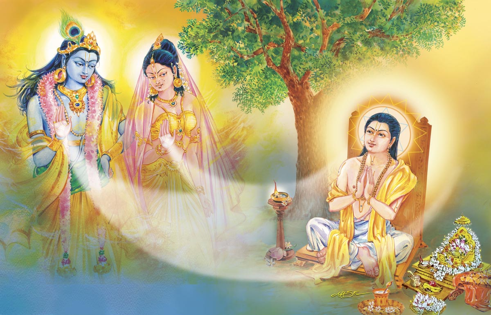
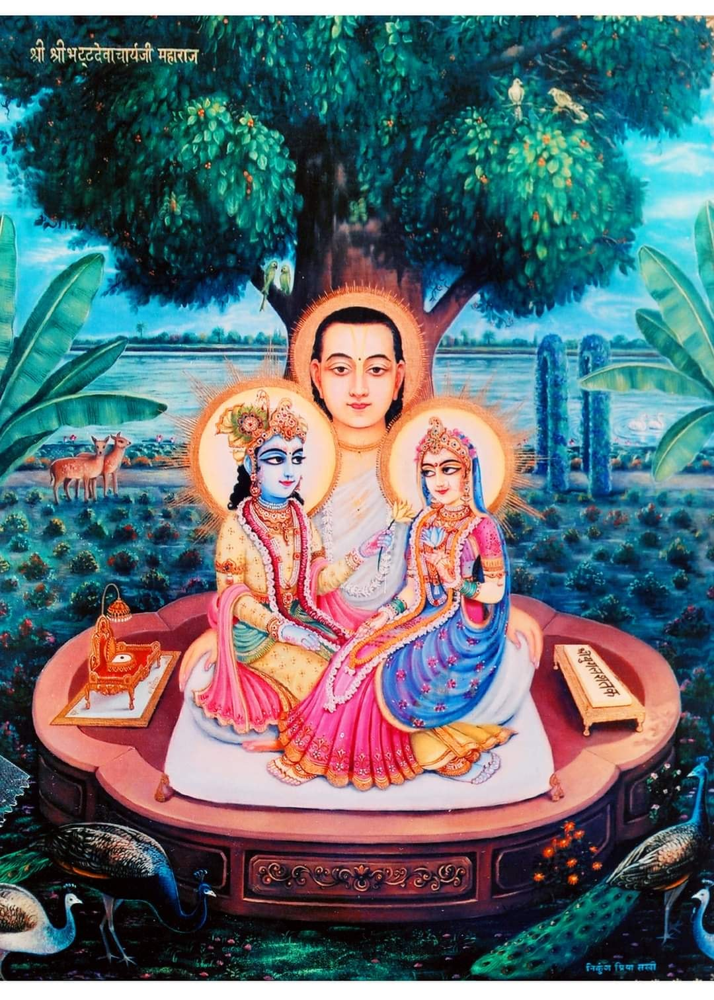
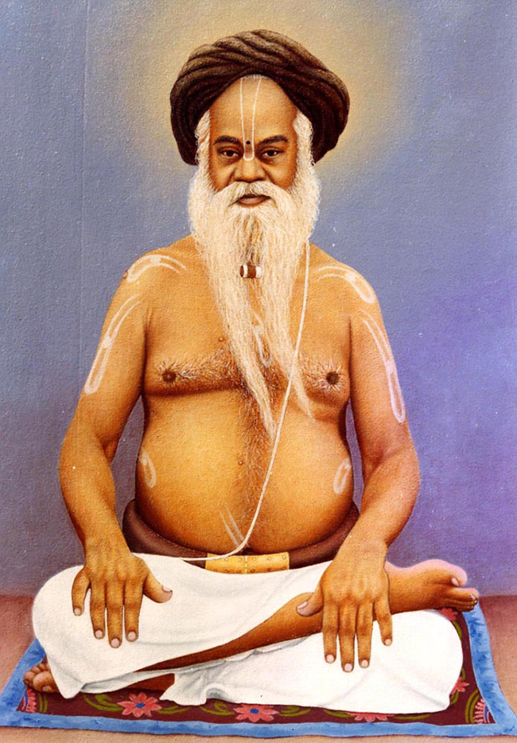
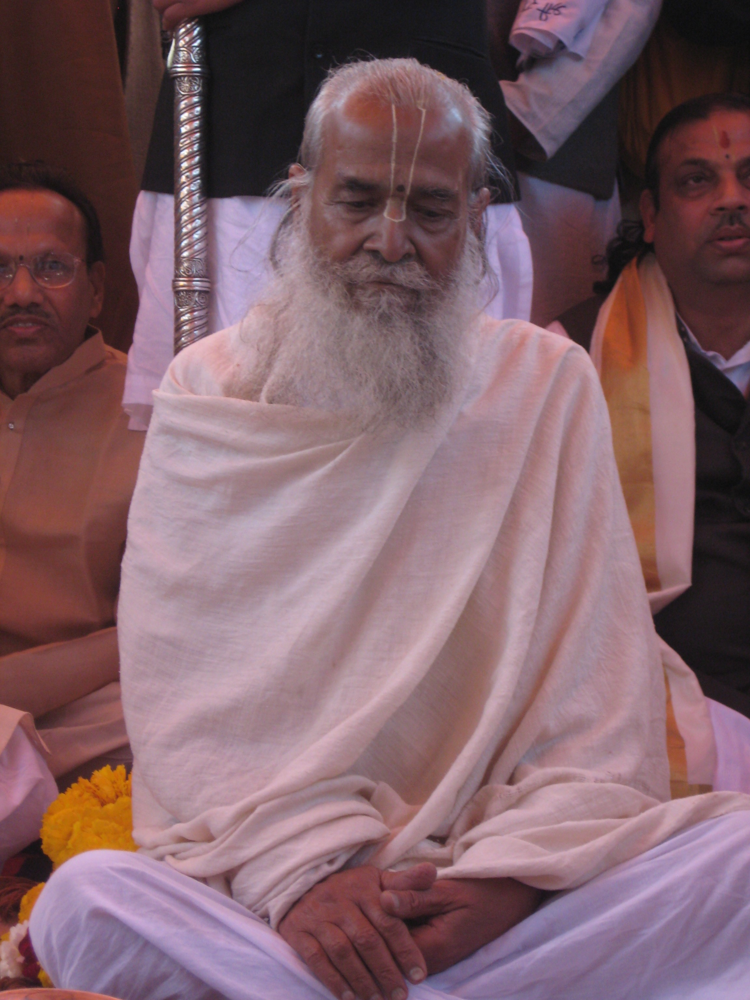

# An introduction to Nimbark Sampraday


**Shri Radha Sarveshwari Vijayate**

## Introduction

_This article is work in progress..._

There are a lot of mysteries that surround the Nimbark sampraday. With very little information available online and very few books available in english, the sampraday may also be difficult for people living outside of India to learn about. This article is an attempt to share a brief overview of the Nimbark sampraday from the perspective of the tradition.

There has been queit a bit of historical work done on the Nimbark sampraday, but given its age and all its contributions to India's rich culture and heritage, it is a treasure chest filled with many more jewels for indologists to discover.

## History


The Nimbark sampraday is the most ancient living vaishnav sampraday. Though some modern scholars try dispute this due to lack of evidence, they themselves present many varying timelines all very far apart with very little evidence to support their claims as well, which is ironic because this falls into the same fallacy that they use against the tradition.

Many indologists have underlined the fact that history has not been kind to the Nimbārka Sampradāya. Nevertheless, the tradition has contributed great luminaries to the heritage of Bhārata. Śhrī Jayadeva Kavi (author of the famous Śhrī Gīta Govinda), members of the royal dynasties of Amer, Jaipur, Jodhpur, Merta, Udaipur, Bikaner, Kishangarh, Rupangarh, Bharatpur, Budhiya (Haryana) and others from the 16th century until Indian independence, the great Hindi poets Ghanānanda, Sundar Kuṃvarī, Bāṅkāvatī, Nāgarī Dās, etc., were all followers of monks of the Nimbārka Sampradāya. Nāgarī Dās, the spiritual name of Maharāja Sāvant Singh (born 1699), was the founding patron of the Kishangarh style of painting. Many hundreds of poems he composed after renouncing, dedicated to the Supreme Lord, are sung not only by Nimbārkīs, but also by followers of the Puṣhṭimārga (Śhrī Vallabhāchārya’s sampradāya). These are a small sample of those who credit their talents to the blessings of the Supreme Lord and the gurus of the Nimbārka Sampradāya.

Nimbārkī monks prefer to worship the Lord in seclusion. They typify the true paramahaṁsa, which is why the tradition is also known as the Paramahaṁsa Sampradāya, the lineage of the supremely renounced. Also especially in the early days, the esoteric knowledge or Radha and the yugal maha mantra was kept secret. This lead to the sampraday dimenitioning towards the 13th to 15th Century. Which then got revived and widespread mainly by Sri Harivyas dev achyarya and his 12 main disciples.

As time passed the sampraday had become very small due to lack of ashrams and preaching. The sampradays head courters was situated in Mathura Vrindavan. Due to the destruction of Mathura and Vrindavan, parts of the history and many important scriptures of the Nimbark sampraday has been lost.

The Sampraday originates from Śrī Hansa Bhagavān to Sri Sankadi Bhagavān (The Four Kumaras), who passed it to their younger brother Sri Narada Muni; and then on to Sri Nimbarka Acharya ji. 

According to tradition, Narada Muni initiated Śrī Nimbārkācārya into the sacred 18-syllabled Śrī Gopāla Mantra, and introduced him to the philosophy of the Yugala upāsana, the devotional worship of the divine couple Śrī Rādhā Kṛṣṇa. 

### Related articles
- [Ancient Nimbark temple, 350 - 400 years old](https://a108.net/blogs/entry/38005-nimbark-temples-of-chhipi-gali-nimbark-kot-ajab-manohar-lal/)

- [Origines of the Ras Lila Tradition](https://a108.net/blogs/entry/15339-karhala-village-origin-of-the-raas-lila-tradition/)


## Philosophy



Sri Nimbark Acharyaji is the sampraday acharya and established the siddhanta known as `Dvaita Advaita` also known as `Bhedabheda`, `Dualistic Non-Dualism`. The jiva(individual soul) is simultaneously one and different to Brahman(Supreme soul) and to jagat/prakriti (material universe/matter).

The relation between Brahman and Jiva, according to Nimbarka is like tree and its branches. Branches have all qualities of the tree, but the branches are not the tree as a whole. Likewise Jiva is anu (small) having all qualities like Brahman(bibhu-large), but with limited extent. Brahman resides in the heart of Jiva, but Jiva has no realization due to Maya (illusion). This is the basic idea of Dvaitadvaita Siddhanta.

Here is a detailed explanation of `Dvaita Advaita`: [Nimbark philosophy](http://shrijagatgurunimbarkacharyapeeth.org/index_files/philosophy.htm)

The tradition follows the teachings of Srimad Bhagavatam and of Sri Nimbark Acharyaji, which state that the worship of Sri Vishnu and His forms are supreme, Thus classifying the Nimbark sampraday as a Vaishnav sampraday. But the only form of Sri Hari that they worship is Sri Sri Radha Krishna. Though in Sri Nimbark Acaryas Vedanta Parijata Saurabha, a commentary on the Vedanta Sutra's, there is no mention of Radha Krishna, this is because many of the sampradays teachings where kept secret, especiialy with Sri Radha being a secret deity during that era, and rasik upasana is outside the direct subject matter of the Veda's, which would not bring much interest to strict Vedantists.

_radhaya sahito devo madhvo vaishavottamaih
archyo bandyashcha dhyeyashcha shrinimbarkapadanugaih_
_- Shri Nimbarka-Sudha_

_"For the followers of Shri Nimbarkacharya they should only worship Shri Radha along with Madhava, Shri Shri Radha Rasik Bihari is the only deity which should be worshipped, which should be prayed to and upon which we should meditate. This is the only goal which is universally accepted by all. In the end, offering respectful obeisances to the lotus feet of all the Devacharyas of the guru parampara and known and unknown Vaishnavas we pray at their holy feet."_

Sri Nimbark Acaryaji worshipped Radha along with Krishna in Sakhi Bhava Upasana method of worship and has been maintained through the parampara up until this very present day. There is no superiority between Radha and Krishna, both are Bhagavaan(God). They are simultaneously one and separate, dvaita advaita. 

_ange tu vaame vrishabhaanujaam mudaa viraajamaanaam anuruupasaubhagaam. sakhiisahasraih parisevitaam sadaa smarema deviim sakalestakaamadaam._
_- Vedanta Kamadhenu Dashashloki, Verse 6, By Sri Nimbark Acaryaji_

*"The left portion of the body of the Supreme Lord is Shri Radha, seated blissfully, as beautiful as the Lord Himself; who is served by thousands of gopis: we meditate on the Supreme Goddess, the fulfiller of all desires."*

_radhaamkrsnasvaroopaam vai, krishnam raadhaasvarupinam; kalaatmaanam nikunjastham gururoopam sadaa bhaje_ 
_- Maha vani_

_"I ceaselessly praise Radha who is none other than Krishna, and Sri Krishna who is none other than Radha, whose unity is represented by the Kaamabeeja and who are forever resident in Nikunja Goloka Vrndavana."_

A lot of this may sound familiar as most people are already acquainted with Gaudiya Vaishnavism. As one can see there are many similarities between the Gaudiya's and Nimbarki's. They share indentical and simalar concepts such as dvaita-advaita, bhakti, tattva's and the worship of Radha Krishna. Therefor a lot of this knowledge is transferable between the sampradays. And of course there are differences as well, one example is that in Nimbark leela, Radha and Krishna are married to each other.


## Practice/Sadhana

Here are the 5 limbs of the sadhana that is performed within the tradition:
1. Karma (ritual action);
2. Vidyā (knowledge);
3. Upāsanā or dhyāna (meditation);
4. Prapatti (surrender to the Lord/devotion);
5. Gurupasatti (devotion and self-surrender to God as Śrī Rādhā Kṛṣṇa)

Even though all 5 limbs are important and required in the body of the Nimbarki sadhana to attain moksha(salvation). Special attention is given towards _Gurupasatti Yoga_. According to Sri Nimbarka, The jiva can attain salvation only by obeying the advices of Guru. If one follows the instructions of his/her Guru in an unperturbed, indiscriminate, unopposed manner he/she can attain the Moksha (liberation from all bondages even births and deaths) without observing any other rituals.

One of the types of dhyaana that the Nimbarki's perform, is that they meditate focusing between their eyebrows or on their bindi, visualizing Radha Krishna's forms and or partaking in leela with Radha and Krishna with one's spiritual body. Most of the rituals, upasana and dhyaana done by most Vaishnava's are in the tantric category of Vedic worship.

Nimbark sampraday's common mantra for all is the `Yugal maha mantra` or `Radha Krishna maha mantra`: 
 
```
Rādhe Kṛṣṇa Rādhe Kṛṣṇa
Kṛṣṇa Kṛṣṇa Rādhe Rādhe
Rādhe Shyām Rādhe Shyām
Shyām Shyām Rādhe Rādhe
```

## Moksha
The type of moksha(liberation) that is focussed on in the Nimbark sampraday is a state of awareness of full individual identity and simultatous oneness with the divine couple Sri Radha Krishna, where one reside's in the eternal realm of Sri Vrindavan Dham with Sri Shyaama Shyaam Yugal Sarkar. One may attain in this life or when one leaves ones physical body an eternal spiritual body with a specific relationship with Radha and Krishna, such as becoming a servant, friend, parent, child, etc with Sri Yugal Sarkar(Radha Krishna). Though other forms of moksha may also be attained, as this is a personal choice.

## Acharya's 

The amount of Acharyas and Mahants in the sampraday is astounding. These are just most of the historically significant Guru Maharaj's.

----


### Jagad Guru Shri Nimbarkacharya Maharaj (4th) (11 century A.D or 3096 A.D [Disputed])

Sri Nimbarkacharya appeared in different ages. It is mentioned in Acharya Charitra, Naimisha Khanda, Vamana Purana and Bhavishya Purana. Once the devotees prayed to the Lord to protect them and the religious path. Then the Lord told His Sudershan Chakra,

_sudarshana! mahabaho! koti-surya-sama-prabhah
ajnana timirandhanam vishnor margam pradarshaya_

_"O supreme invincible one! Powerful like millions of suns. O My supreme devotee. Show the path of Vishnu, the devotional path, to these people who are suffering in darkness due to ignorance."_

As per the oral tradition and Puranic evidence's, one main sources being the Bhavishya Purana, it is stated that Nimbark Acarya incarnated in the year 3096 A.D and explains more details about the divine appearance of Sri Nimbark Acaryaji.

_Then Sudarshana Chakra decided to take his incarnation by the order of the Lord. He advented himself in the beginning of kali yuga, from today(2022) about 5098 years ago, in the East-South part of India on the bank of the Godavari river near the city of Vaidurya Pattan at Sudarshana Ashrama in the womb of Sadhvi Jayanti Devi, the wife of Aruna Rishi, who was in the dynasty of Bhrigu at dusk during the karttika month, Shukla Purnima. In his childhood he went on a pilgrimage with his parents and reached Vraja mandala. He performed austerities under Goverdhan hill in a village named Nimbagaon and showed the path of devotion to Radha and Krishna. Once Brahma came in the form of a renunciate in order to take the darshan of Sudarshana who was there as a small boy. Sudarshana wanted to give honour to Brahma. He showed him the darshan of Surya from the middle of a neem tree, though it was already sunset. When Brahma understood that the Lord in the form of Surya gave his darshan through a neem tree, he said, "You will be famous by the name of "Nimbarka" and disappeared._

The Sutras of Maharishi Veda Vyasa form the basis of Vedanta. From the various interpretations of the same, four  main schools of thought emerged. The Keval Advaita of Sri Sankaracharya, the Visishta Advaita of Sri Ramanujacharya, the Dvaita philosophy of Sri Madhavacharya and the Bhedabheda or Dvaitadvaita philosophy of Sri Nimbarkacharya.  However, Sri Nimbarkacharya has been able to reconcile all the other school of thoughts and his Bhashya on the Brahma Sutras appears to pre-date all other Bashyas on the Brahma Sutras.

Nimbark Acarya has written the following scriptures and commentaries:
```
- Vedānta Pārijāta Saurabha– Commentary on the Brahma Sutras
- Sadācāra Prakāśa– Commentary on the Bhagavad-Gītā
- Rahasya Ṣoḍaśī- Śrī Gopāla Mantra explained
- Prapanna Kalpa Vallī- Śrī Mukuṇḍa Mantra explained
- Prapatti Cintāmaṇi – On Supreme surrender
- Prātaḥ Smaraṇa Stotram
- Daśa Śloki or Kāmadhenu– Ten Verses
- Saviśeṣa Nirviśeṣa
- Śrī Kṛṣṇa Stavam
```

-----
### Shri Shrinivasacharyaji Maharaj (5th)
Shri Shrinivasacharyaji Maharaj, the foremost disciple of Shri Nimbarkacharya, who wrote a masterly analysis of the Vedanta Parijata Sourabh, composed by his Guru, named `Vedanta Koustubh Bhashya`.

There are many other holy works besides this, of which only `Laghustavaraja` is also well known work. `Parijat Saurabh Bhashya`, `Rahasya Prabandha`, `Kathopanishad Bhashya` etc. are unavailable.

-----
### Shri Purushottamacharyaji (7th)
The `Vedanta Kamadhenu Dashashloki` composed by Shri Nimbarkacharya was further explained by Acharya Shri Purushottamacharyaji, under the name of `Vedanta Ratna Manjusha`, which is one of his well respected works.

-----
### Shri KeshavKashmiri Bhattacharyaji Maharaj (33rd)(Around 1420-1490)
He was renowned scholar through out india and was also known as Digvijay (Who is victorious over everyone) by being victorias in his debates throughout India.

Shri KeshavKashmiri Bhattacharyaji Maharaj elaborated on the `Vedanta Koustubh Bhashya` Sri Nimbark Acharya's commentary on Vedanta Sutras, in His well received work titled, `Prabhavritti` or `Vedanta Kaustubh Prabhavritti`. 

This acharya’s work named `Kramdipika` on Tantra is very famous. Maharaji also wrote a commentary on the Bhagavad Gita titled `Tattva Prakashika`. 

He is also known for defeating the purpose of the YANTRA placed by Yavan Kaji at the Vishram Ghat in Mathura, by using his own Yantra, thus upholding the Hindu Culture and also the Vedic Vaishnava Sampradayas.


Viśhrām Ghāṭ in Vṛindāvan, the headquarters of the Nimbārka Sampradāya from the time of Śhrī Keśhavakāśhmīri Bhaṭṭāchārya (1400’s) until the 1560’s, when Jagadguru Swāmī Paraśhurāma Devāchārya relocated it to Salemabād, Ajmer, in Rajasthan.


-----


### Swami Sri Sribhatta Devāchārya (34th)(Around 1440-1520)

It is said the he was the first-ever author to compose Vāṇī poetry in Braj Bhāṣhā. This Vani is called `Yugala Shataka`. 

-----
### Sri Hari Vyas Dev Acharya (35th)(Around 1470-1540)
One of the most important Acarya's in the sampraday is Sri Hari Vyas Deva Acharyaji. He spread the nimbark sampraday at large with his 12 main disciples.

He too has many texts composed in Sanskrit and Vrajbhasha. Among them `Siddhanta Ratnanjali` in Sanskrit is the most famous. This book is in the form of interpretation of `Vedanta Kamadhenu Dashashloki` by Shri Nimbark Acharya. `Mahavani` is the main text in Vrajbhasha . This rasa is considered the best among the scriptures. This Mahavani is like a great commentary of `Sri Yugal Shatak` by Shri Bhattadevacharyaji. 

[Sri Hari Vyas Dev Acharya Biography](https://www.brajrasik.org/articles/5ef709f8e6bb820063961227/biography-of-shri-harivyas-devacharya) 

-----
### Shri Parashuramdevacharya Ji (36th)(1525-1607)
The anointed Acharya of the Nimbark sampraday by Sri Harivyas Dev Acharya and he established the new Acharya Peeth in Salemabad. 
All the acharays in this line inherent the Shaligram Shila that was originally worshiped by Shri Nimbark Acharya.
This Shaligram Shila is still worskipped and past down the the present day Nimbark sampraday Acharya.

His creation is a huge book called `Parshuram Sagar`. His compositions have been done in many verses like couplets, verses, chaupai, varva, chappay and pad etc. This huge book has been published in four parts. its Editing by scholar Shriramprasad G Sharma M.A. Ph. D. Former spokesperson Government College Kishangarh (Rajasthan) has done it.

----
### Svāmī Svabhūrāma Devācārya (36th)(Around early 16th century)
Svāmī Svabhūrāma Devācārya (fl.16th century CE) was born in Budhiya Village, outside Jagadhri and Yamunanagar near Kurukshetra in modern Haryana, India. He established over 52 temples in Punjab, Haryana and Vraja during his lifetime; his current followers are found mostly in Vṛndāvana, Haryana, Punjab, Bengal, Rajasthan, Orissa, Assam, Sikkim, Bihar, other regions in Uttar Pradesh and Maharashtra, also in significant numbers in Nepal.

-----
### Sri Chatur Chintamani Devacharya (Nagaji Maharaj)(39th)
Sri Nagaji Maharaji is famed as the initiator of the famous Braja 84 Kos Parikrama Yatra. By virtue of unflinching spiritual penances and practices Chatura Chintamani Maharaj possessed such spiritual powers that He would do the circumambulation of the Braja 84 Kos (approx. 300km) in a day which a normal devotee takes around 42 days. But, even after years of resolved spiritual penances The Divine vision of the Yugal Sarkar eluded Nagaji. Once Nagaji was so frustrated with Bhagwan for not revealing himself that he started to walk away from Vrindaban with an intension of leaving Brajadham forever. But while Chatura Chintamani ji started to walk off from His perch, His “Jata”, long locks got entangled in the bushy thorns. He could not move a bit and was stuck there for three night and three days without food and shelter, but with firm faith that Lord will come down to rescue. Lord too was testing His devotee’s fortitude. However, Radharani , the ever compassionate mother could not bear the sight anymore and appeared to Nagaji along with Lord. She brought food and sweet milk for her devotee and fed it herself to him just like a mother. Together the divine couple detangled the locks from the thorny shrubs and fulfilled Nagaji’s long cherished wish. This lila of Bhakt and Bhagwan has been highly gloried in the whole of Vaishnava community till date.


-----


### Yogiraj Swami Ramdas Kathia Baba Maharaj (54th)(1800 – 1909)

Yogiraj Swami Ramdas Kathia Baba Maharaj, was a self-realised saint who personified supreme devotion and wisdom. He would revel in the divine vison of the Yugal Sarkar every moment, but his outward eccentric attitude and childlike demeanour would never reveal His greatness. Lucky few could fathom the depth of His spiritual splendour by solely His grace. He was highy revered in the Vaishnava community and Sadhu samaj as a whole and was bestowed with the title of Brajabidehi, Chatur Sampraday Mahant. It is said that after Sri Kathia Baba left his mortal body, tears flowed continuously for 13 days from the stone idol of Srimati Radharani ji. It was so bad that the stone eyes of the idol had to be replaced with a new pair.


-----


### Swami Santadas Kathiababa Maharaj (55th)(1859 - )
A leading disciple of Sri Sri 108 Ramdas Kathiababa Maharaji. At the place of Jagannath Ghat, Gangotri, the source of the Ganges, floated in front of him and Har-Parvati, who was present in it, visited him. Lord Shankara then gave him a monosyllabic seed mantra and by chanting that mantra he would gain Sadguru - with such an assurance they disappeared. Then the scene of that Gomukh Gangotri in the Himalayas also disappeared. He started chanting that seed mantra with great devotion. In search of a good guru, he went on various pilgrimages and gradually he arrived at the Prayag Kumbh Mela with a friend. Although his interview here was with his future Gurudev Sri Sri Kathia Babaji Maharaj, he was skeptical about whether he would take him seriously. He saw some miracles of Sri Sri Ram Das Kathia Babaji Maharaj, but could not be completely accept it without doubt. Then he went to Vrindavan in the month of Chaitra and this time he was almost disappointed to see his work from very close to Kathia Babaji Maharaj. Far from considering Sri Sri Kathia Babaji Maharaj as a Brahmajna Mahapurusha, Sri Tarakishore Babu considered him to be an ordinary old village saint. But when his miraculous deeds came to mind, he could not understand exactly what was wrong with his decision. With this skeptical mind he returned to Calcutta. One night in Calcutta, when he was sleeping on the roof of his house, he suddenly woke up and sat up. He saw Sri Sri Ramdas Kathia Babaji Maharaj coming towards Akash Marg and in a short time he came down to him on that roof. After that, Kathia Babaji Maharaj gave a mantra in his ear and left again. There was no other doubt in the mind of Sri Tara Kishore Sharma Chowdhury about Sri Sri Kathia Babaji Maharaj. All his hesitations were immediately dispelled and he considered himself fortunate to have taken refuge in the desired Sadguru. Even after being miraculously initiated in this way, he formally took wife's initiation in Vrindavan on the day of Janmashtami in 1894.


-----


### Swami Dhyananjoy Das Kathia Baba Maharaj(56th)(1901 - 1983)
A leading disciple of Sri Swami Santadas Kathiababa Maharaj.
In India, Mahamuni Vrigu, who was both an ascetic of exceptional
distinction and an astrologer of hitherto insurmountable calibre, kept prepared
various types of horoscopes with his masterly analysis. One such horoscope was
found in Benaras which was exactly similar to what was prepared by the villageastrologer where our Master was born. Thus, the coming of Srimat Swami
Dhananjoydasji Kathia Baba was planned long long before, even thousands of
years ago and his horoscope was kept ready even when nobody could conceive of
his arrival.

In that horoscope, Vrigu had given us the following account of the
Swami’s life:
He will be a holy man whose wisdom will always be guided by religious
tendencies. He would be devoted to Super Conscient and obedient to his superiors.
He would be of religious bent of mind. He would have complete union with the
Super-Conscious, attain all sorts of fulfillment and will be a possessor of third eye.
He will have both transcendental wisdom and vision and will be victorious in all
spheres of his life. He will be a ‘paramahansa’. After leaving this world he will be
in complete union with the Param Brahman.
The life of Sri Sri Babaji Maharaj has fully justified the prophecy of that
ancient sage.


-----


### Shri Radhasarveshwar Sharan Devacharya Shri (Shri Shriji Maharaj (48th)(1921 - 2017)

[Shri Shriji Maharaji - Biography](http://www.shrijagatgurunimbarkacharyapeeth.org/#SHRI_SRIJI_MAHARAJ)

-----
`Sri Jayadev Goswami` who wrote the immaculate sacred poem called `Gita Govinda` in sanskrit.

-----
`Swami Haridas` who founded his own sampraday called `Sri Haridas sampraday` is connected to a branch of the Nimbark sampraday that is coming from the 16th Acharya Sri Devacharyaji

-----

## Branches of Sri Nimbark sampraday
Their are 12 main branches from the Nimbark sampraday are originating from the 35th Acharya Sri Harivyas Dev Acharya's 12 main disciples, maybe 5 or 6 of these branches are still alive today. And there may be other branches such as Sri Haridas Sampraday, which are not connected to Sri Harivyas Dev acharya that are still alive.

The two most promiment branches today connecting to Sri Harivyas dev acharya is:
- `Shri Parashuramdevacharya Ji (36th)` -  Acharya Peeth branch.

- `Svāmī Svabhūrāma Devācārya(36th)` - Which is connected to `Sri Indra Dasji Kathia Babaji Maharaj(50th)` the first Nimbarki to receive the title `Kathia baba`

The saints were called Kathia Baba Maharaj by the common people due to the very unique thick wooden belt (kath) and white piece of cloth (kaupin) worn by them which indicated their renunciation of all bodily pleasures.
  
The Kathia Baba's where originally siddha babaji's that come down from the Himalayas. This has influenced this branch with different practices of tapasya and a strong emphasis on vairagya. They normally have long dread locks and wear a thick wooden belt.

The first Kathia Baba that come down from the Himalayas to start popularising the branch was `Sri Ram Das Kathia Baba(54th)`. 

## Tilak
The tilak of the Nimbark sampraday can mean two or more things:

1. The yellow line represents a mandir, and the bindi represents the murti of Sri Sri Radha Krishna or the yog pit, a mandala where Radha Krishna and the Sahecharis live. 

2. The yellow outline represents Sriji's(Radha's) charan(Lotus feet) and the black bindi between the eye brows represents Krishna.

## Sannyasi or Babaji
The renunciates in Nimbark sampraday are known as babaji's. They do not wear saffron, they wear a white dhoti with no pleat and white or yellow shaul.

## Scripture's
Their are many different scriptures, but the main scriptures that are focused on are: `Bhagavad Gita`, `Srimad Bhagavatam`, `Bhakta Maal` and the rasiks recite `Maha Vani`.

There are some scholarly Nimbark ashrams that Study Sanskrit, Vedanta and Nimbarkji's scriptures. But those ashrams are few.

## Resources:
- [The life and teachings of Shri Nimbarka Acharya](https://www.hinduismtoday.com/educational-resources/the-life-teachings-of-one-of-indias-great-luminaries-shri-nimbarka/)

- [Nimbark philosophy](http://shrijagatgurunimbarkacharyapeeth.org/index_files/philosophy.htm)

- [Nimbark parampara](https://nimbarka.wordpress.com/shri-nimbarka-sampradaya/2008/shri-acharya-parampara-the-guru-disciple-lineage/)

- [Nimbark sampraday](https://nimbarka.wordpress.com/shri-nimbarka-sampradaya/)

- [An introduction to Nimbark sampraday](https://hi-in.facebook.com/TheGloriousBangioNimbarSamprodoyAshram/posts/shri-radhejai-jagat-guru-shri-nimbarka-achraya-juthe-universal-tradition-of-the-/2460105870717820/)
- [Nimbark sampraday - divine life soceity](https://www.dlshq.org/saints/nimbarka/)

- [Nimbark Wiki](https://vedanta.redzambala.com/traditions/nimbarka-sampradaya-nimbarka.html)

- [Nimbark Parikar](https://nimbarkparikar.blogspot.com/)

## The End

_vanchha kalpatarubhyashcha kripa sindhubhya eva cha
patitanam pavanebhyo vaishnavebhyo namo namah_