## History

Many indologists have underlined the fact that history has not been kind to the Nimbārka Sampradāya. Nevertheless, the tradition has contributed great luminaries to the heritage of Bhārata. Śhrī Jayadeva Kavi (author of the famous Śhrī Gīta Govinda), members of the royal dynasties of Amer, Jaipur, Jodhpur, Merta, Udaipur, Bikaner, Kishangarh, Rupangarh, Bharatpur, Budhiya (Haryana) and others from the 16th century until Indian independence, the great Hindi poets Ghanānanda, Sundar Kuṃvarī, Bāṅkāvatī, Nāgarī Dās, etc., were all followers of monks of the Nimbārka Sampradāya. Nāgarī Dās, the spiritual name of Maharāja Sāvant Singh (born 1699), was the founding patron of the Kishangarh style of painting. Many hundreds of poems he composed after renouncing, dedicated to the Supreme Lord, are sung not only by Nimbārkīs, but also by followers of the Puṣhṭimārga (Śhrī Vallabhāchārya’s sampradāya). These are a small sample of those who credit their talents to the blessings of the Supreme Lord and the gurus of the Nimbārka Sampradāya.

Nimbārkī monks prefer to worship the Lord in seclusion. They typify the true paramahaṁsa, which is why the tradition is also known as the Paramahaṁsa Sampradāya, the lineage of the supremely renounced. Also especially in the early days, the esoteric knowledge of Shri Radha and the Yugal maha mantra was kept secret. This lead to the sampraday slowly diminishing and towards the 15th century it was almost lost, having a very small following only. But fortunately the sampraday was revived and widespread during the 15th and 16th century by Shri Harivyas Dev acharya and his 12 main disciples.


## Acharya's

The amount of Acharyas and Mahants in the sampraday is astounding. These are just most of the historically significant Guru's.

----
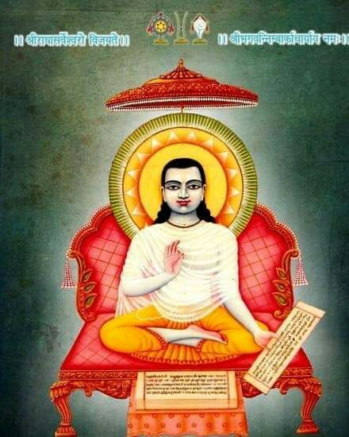

### Jagad Guru Shri Nimbark Acharya (4th) (3096 bce)

Sri Nimbark Acharya appeared in different ages as mentioned in the Acharya Charitra, Naimisha Khanda, Vamana Purana and Bhavishya Purana. Once the devotees prayed to the Lord to protect them and the religious path. Then the Lord told His Sudershan Chakra,

``` At the end of dvāpara yuga, Sudarśana will take birth, as commanded by Kṛṣṇa.
Known as Nimbāditya, he will remove dharma’s lassitude.
- Bhaviṣyapurāṇa, Pratisargaparvan 7.67.
```

```
sudarshana! mahabaho! koti-surya-sama-prabhah
ajnana timirandhanam vishnor margam pradarshaya

"O supreme invincible one! Powerful like millions of suns. O My supreme devotee. Show the path of Vishnu, the devotional path, to these people who are suffering in darkness due to ignorance."
```

_Then Sudarshana Chakra decided to take his incarnation by the order of the Lord. He advented himself in the beginning of kali yuga, from today(2022) about 5098 years ago, in the East-South part of India on the bank of the Godavari river near the city of Vaidurya Pattan at Sudarshana Ashrama in the womb of Sadhvi Jayanti Devi, the wife of Aruna Rishi, who was in the dynasty of Bhrigu at dusk during the karttika month, Shukla Purnima. In his childhood he went on a pilgrimage with his parents and reached Vraja mandala. He performed austerities under Goverdhan hill in a village named Nimbagaon and showed the path of devotion to Radha and Krishna. Once Brahma came in the form of a renunciate in order to take the darshan of Sudarshana who was there as a small boy. Sudarshana wanted to give honour to Brahma. He showed him the darshan of Surya from the middle of a neem tree, though it was already sunset. When Brahma understood that the Lord in the form of Surya gave his darshan through a neem tree, he said, "You will be famous by the name of "Nimbarka" and disappeared._

The meaning of the name "Nimbarka" is as follows: 
```
He was like a medicinal fruit (nimba) in curing people from the disease of the world, and he was like the sun (arka) in removing the darkness of the heart.
- Mangala-pata, Tattva Prakashika (Shri Kesheva Kashmiri)
```

Nimbark Acarya has written the following works and commentaries:
```
- Vedānta Pārijāta Saurabha– Commentary on the Brahma Sutras
- Sadācāra Prakāśa– Commentary on the Bhagavad-Gītā
- Rahasya Ṣoḍaśī- Śrī Gopāla Mantra explained
- Prapanna Kalpa Vallī- Śrī Mukuṇḍa Mantra explained
- Prapatti Cintāmaṇi – On Supreme surrender
- Prātaḥ Smaraṇa Stotram
- Daśa Śloki or Kāmadhenu– Ten Verses
- Saviśeṣa Nirviśeṣa
- Śrī Kṛṣṇa Stavam
- Radhashtakam
```

#### Shri Nimbarks date of birth contraversy 

The latest research by Indological scholars (Ramnarace 2015, Malkovsky 2001, Agrawal 2000 and Satyanand 1997) has shown that it is likely that Śhrī Nimbārka lived sometime between 620-690ce, though the Nimbārka Sampradāya maintains the Bhaviṣhya Purāṇa’s statement that he incarnated on Kārtika Pūrṇimā 3096bce, six years after Bhagavān Śhrī Kṛiṣhṇa concluded His earthly pastimes. Whether we accept the tradition’s dating or that of the scholars, it is still clear that Nimbārka’s School of Vedānta precedes all the currently extant schools.

Shri Nimbark ji, ofcourse, criticises like other commentators, the theories of the Samkhya Yoga, etc. (V.P.S. 2.2), but he makes no attempt at criticising
other schools of the Vedanta.

There are many rival tenets that Shri Shankar Acharya ji countered belonged to Bhedābheda (also known by the synonym Dvaitādvaita), which scholars suggest is the oldest philosophical understanding of Vedānta, a fact to which pre-eighth century Buddhist writings attest.


#### Bhavisya purana contraversy

```
sudarśano dvāparānte kṛṣṇājñapto janiṣyati | nimbāditya iti khyāto dharmaglānir hariṣyati ||
Bhaviṣyapurāṇa, Pratisargaparvan 7.67.

At the end of dvāpara yuga, Sudarśana will take birth, as commanded by Kṛṣṇa.
Known as Nimbāditya, he will remove dharma’s lassitude.
```

The available versions of Bhavishya Purana are based on a printed text published during the British colonial era (1858 to 1947).

In records of land grants of the 5th century CE, verses are quoted which occur only in the Padma, Bhavishya, and Brahma Puranas. This gives us more evidence that the current version of the Bhavisyapurana seems to be a very recent version.

Therefor many scholars do not accept statements from the modern Bhavisya purana as evidence and the original version seems to be lost.

Shri Keśava Kashmiri and the later authors of this tradition utilised the statement of the Bhaviṣyapurāṇa as an authoritative basis for their assumptions.

```
bhaviṣyapurāṇe śrīvyāsavacanāc chrīnimbārkācāryasyaiva bhagavac-chabdābhihitatvena
sarvajñatvāt sarvebhyaḥ prācīnācāryāc ca…|| Bhagavadgītā Tattvaprakāśikā introduction, ch. 1.

Due to the statement of Śrī Vyāsa in the Bhaviṣyapurāṇa, in which Śrī Nimbārka is
omniscient in as much as he is addressed as ‘Bhagavat’, and thus is the most ancient of all
the [other Vedānta-]ācāryas…’ 
- Bhagavadgītā Tattvaprakāśikā introduction, ch. 1. - Shri Kesheva Kashmiri
```

As Shri Keshava is references an ancient version of the Bhavishya Purana. This adds validity that the information about Shri Nimbark Acharya in the Bhavisha purana is true, unfortuntly the exact date was not given by Shri Keshava Kashmiri.

The interpolations other than the date of birth for Shri Nimbark Acharya can serve no purpose to the sampraday, and these interpolations happened after the above quote. If the Bhavisya Purana of Shri Keshava Kashmiri accepted Shri Nimbark as the oldest Acharya, then what is the point to add extra years to make Shri Nimbark Acharya even older? Going through all that trouble for such a tiny change, for such little gain does not sound logical to me.

Also the sampraday has never used the date of Shri Nimbark Acharya as a preaching point. And it was only after Shri Keshava Kashmiri that the sampraday got riveved and widespread by Shri Harivyas Dev acharya. And there was no propoganda needed for a well known Siddha Babaji that has no contriversies and was accepted by all sampradays in Vrindavan. Infact the Nimbarkis especially during that time period where not big preachers, but rather spent their time relishing their spiritual pracises in reclusion.

Without the statement of the Bhavisya Purana it is stil clear that Shri Nimbark Acharya is the oldest known Vedantist. Therefor the Nimbarki's holds that the history about Nimbark Acharyas life and datings in the Bhavisya Purana to be true as per the oral tradition.

-----
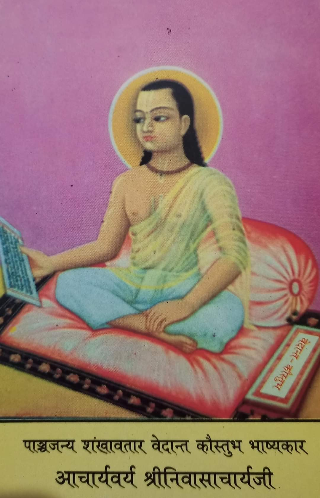

### Shri Shrinivasacharyaji Maharaj (5th)

Shri Shrinivasacharyaji Maharaj, the foremost disciple of Shri Nimbarkacharya, he is known as the Shank avatar, or the incarnation of the Panchajaya, the conch shell of Vishnu.

He who wrote a masterly analysis of the Vedanta Parijata Sourabh, composed by his Guru, named `Vedanta Koustubh Bhashya`.

There are many other holy works besides this, of which only `Laghu Stavaraja` is avalable, it is a collection of forty-one verses in praise of Shri Nimbark. `Parijat Saurabh Bhashya`, `Rahasya Prabandha`, `Kathopanishad Bhashya` etc. are unavailable.

-----
### Shri Purushottamacharyaji (7th)

The `Vedanta Kamadhenu Dashashloki` composed by Shri Nimbarkacharya was further explained by Acharya Shri Purushottamacharyaji, under the name of `Vedanta Ratna Manjusha`, which is one of his well respected works.

-----
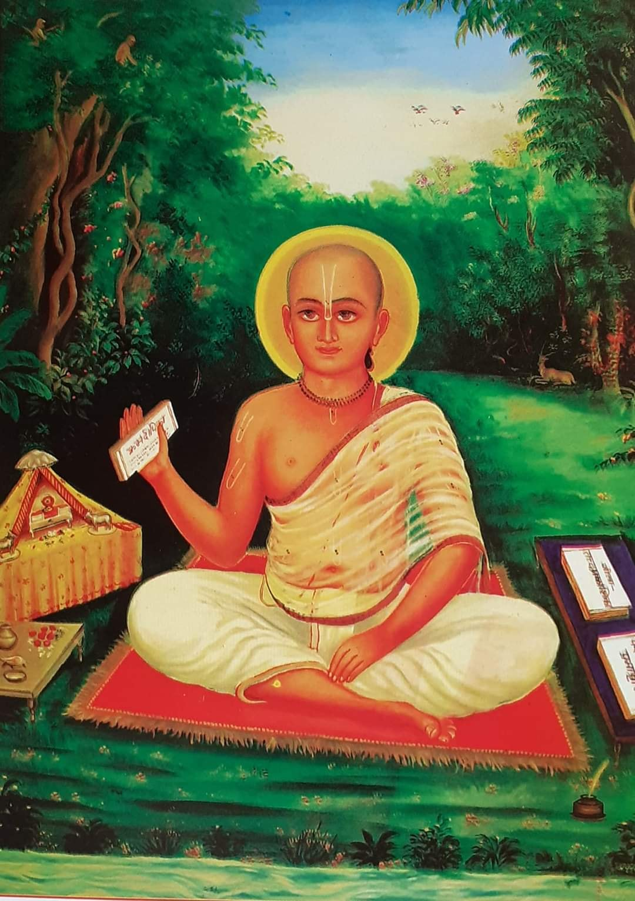

### Shri Keshava Kashmiri Bhattacharyaji Maharaj (33rd)(Around 1420-1490)

He was renowned scholar through out india and was also known as Digvijay (Who is victorious over everyone) by being victorias in his debates throughout India.

Shri KeshavKashmiri Bhattacharyaji Maharaj elaborated on the `Vedanta Koustubh Bhashya` Sri Nimbark Acharya's commentary on Vedanta Sutras, in His well received work titled, `Prabhavritti` or `Vedanta Kaustubh Prabhavritti`. 

This acharya’s work named `Kramdipika` on Tantra is very famous. Maharaji also wrote a commentary on the Bhagavad Gita titled `Tattva Prakashika`. 

He is also known for defeating the purpose of the YANTRA placed by Yavan Kaji at the Vishram Ghat in Mathura, by using his own Yantra, thus upholding the Hindu Culture and also the Vedic Vaishnava Sampradayas.

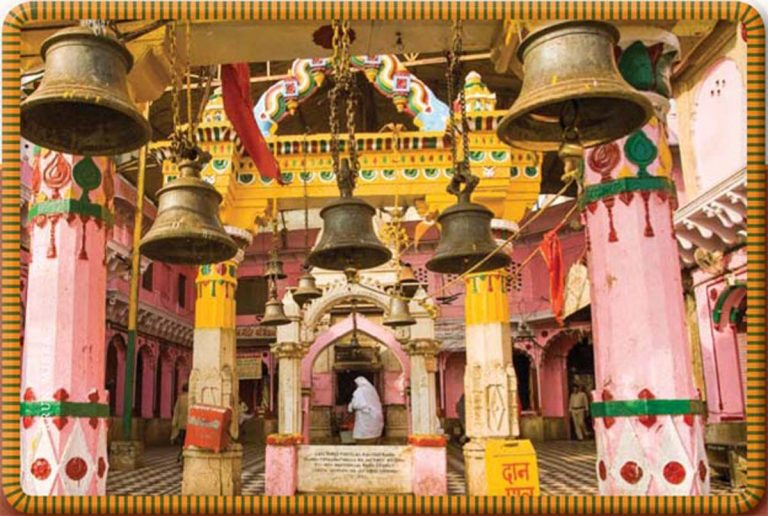

Viśhrām Ghāṭ in Vṛindāvan, the headquarters of the Nimbārka Sampradāya from the time of Śhrī Keśhavakāśhmīri Bhaṭṭāchārya (1400’s) until the 1560’s, when Jagadguru Swāmī Paraśhurāma Devāchārya relocated it to Salemabād, Ajmer, in Rajasthan.


-----
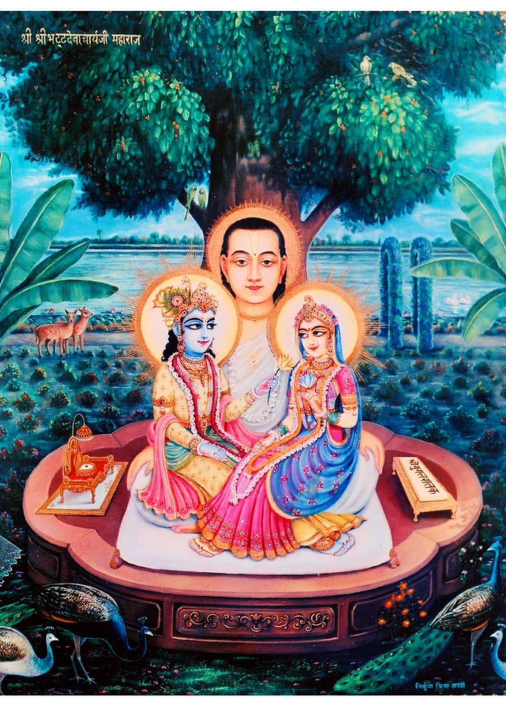

### Swami Sri Sribhatta Devāchārya (34th)(Around 1440-1520)

It is said the he was the first-ever author to compose Vāṇī poetry in Braj Bhāṣhā. This Vani is called `Yugala Shataka`. 

-----
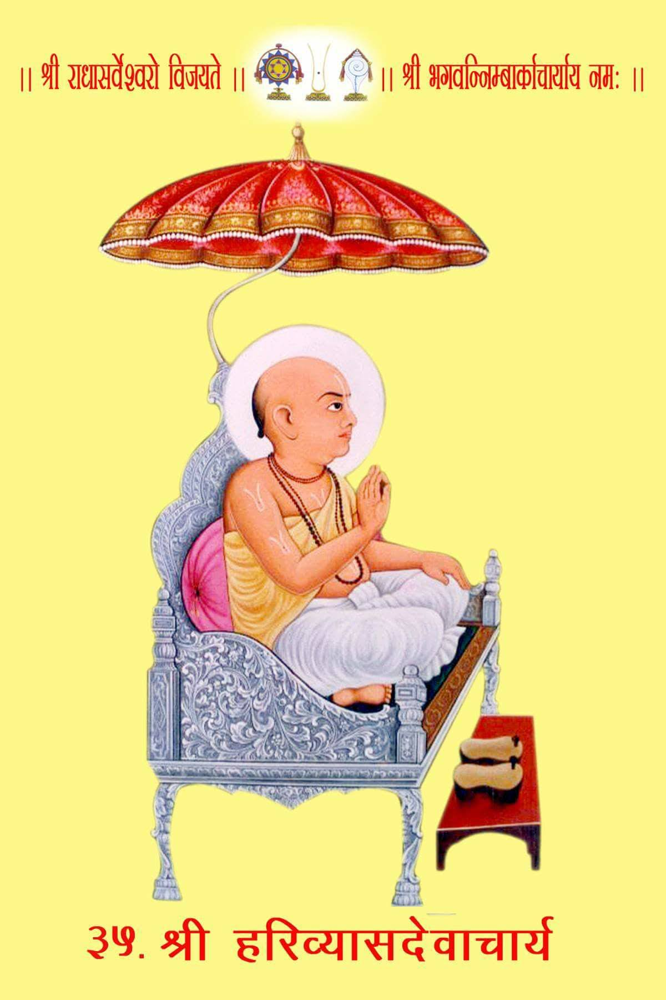

### Sri Hari Vyas Dev Acharya (35th)(Around 1470-1540)
One of the most important Acarya's in the sampraday is Sri Hari Vyas Deva Acharyaji. He spread the nimbark sampraday at large with his 12 main disciples.

He too has many texts composed in Sanskrit and Vrajbhasha. Among them `Siddhanta Ratnanjali` in Sanskrit is the most famous. This book is in the form of interpretation of `Vedanta Kamadhenu Dashashloki` by Shri Nimbark Acharya. `Mahavani` is the main text in Vrajbhasha . This rasa is considered the best among the scriptures. This Mahavani is like a great commentary of `Sri Yugal Shatak` by Shri Bhattadevacharyaji. 

[Sri Hari Vyas Dev Acharya Biography](https://www.brajrasik.org/articles/5ef709f8e6bb820063961227/biography-of-shri-harivyas-devacharya) 

-----
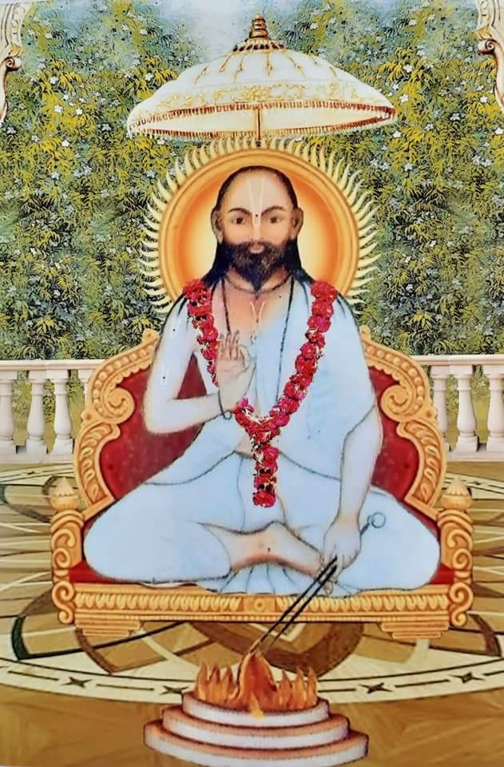

### Shri Parashuramdevacharya Ji (36th)(1525-1607)
The anointed Acharya of the Nimbark sampraday by Sri Harivyas Dev Acharya and he established the new Acharya Peeth in Salemabad. 
All the acharays in this line inherent the Shaligram Shila that was originally worshiped by Shri Nimbark Acharya.
This Shaligram Shila is still worskipped and past down the the present day Nimbark sampraday Acharya.

His creation is a huge book called `Parshuram Sagar`. His compositions have been done in many verses like couplets, verses, chaupai, varva, chappay and pad etc. This huge book has been published in four parts. its Editing by scholar Shriramprasad G Sharma M.A. Ph. D. Former spokesperson Government College Kishangarh (Rajasthan) has done it.

----
### Svāmī Svabhūrāma Devācārya (36th)(Around early 16th century)
Svāmī Svabhūrāma Devācārya (fl.16th century CE) was born in Budhiya Village, outside Jagadhri and Yamunanagar near Kurukshetra in modern Haryana, India. He established over 52 temples in Punjab, Haryana and Vraja during his lifetime; his current followers are found mostly in Vṛndāvana, Haryana, Punjab, Bengal, Rajasthan, Orissa, Assam, Sikkim, Bihar, other regions in Uttar Pradesh and Maharashtra, also in significant numbers in Nepal.

-----
### Sri Chatur Chintamani Devacharya (Nagaji Maharaj)(39th)
Sri Nagaji Maharaji is famed as the initiator of the famous Braja 84 Kos Parikrama Yatra. By virtue of unflinching spiritual penances and practices Chatura Chintamani Maharaj possessed such spiritual powers that He would do the circumambulation of the Braja 84 Kos (approx. 300km) in a day which a normal devotee takes around 42 days. But, even after years of resolved spiritual penances The Divine vision of the Yugal Sarkar eluded Nagaji. Once Nagaji was so frustrated with Bhagwan for not revealing himself that he started to walk away from Vrindaban with an intension of leaving Brajadham forever. But while Chatura Chintamani ji started to walk off from His perch, His “Jata”, long locks got entangled in the bushy thorns. He could not move a bit and was stuck there for three night and three days without food and shelter, but with firm faith that Lord will come down to rescue. Lord too was testing His devotee’s fortitude. However, Radharani , the ever compassionate mother could not bear the sight anymore and appeared to Nagaji along with Lord. She brought food and sweet milk for her devotee and fed it herself to him just like a mother. Together the divine couple detangled the locks from the thorny shrubs and fulfilled Nagaji’s long cherished wish. This lila of Bhakt and Bhagwan has been highly gloried in the whole of Vaishnava community till date.


-----
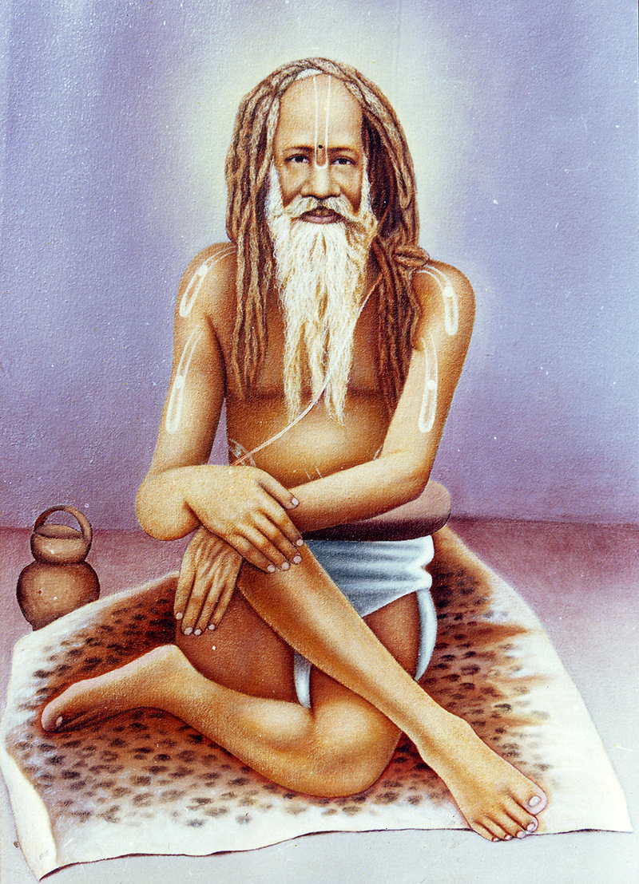

### Yogiraj Swami Ramdas Kathia Baba Maharaj (54th)(1800 – 1909)

Yogiraj Swami Ramdas Kathia Baba Maharaj, was a self-realised saint who personified supreme devotion and wisdom. He would revel in the divine vison of the Yugal Sarkar every moment, but his outward eccentric attitude and childlike demeanour would never reveal His greatness. Lucky few could fathom the depth of His spiritual splendour by solely His grace. He was highy revered in the Vaishnava community and Sadhu samaj as a whole and was bestowed with the title of Brajabidehi, Chatur Sampraday Mahant. It is said that after Sri Kathia Baba left his mortal body, tears flowed continuously for 13 days from the stone idol of Srimati Radharani ji. It was so bad that the stone eyes of the idol had to be replaced with a new pair.

In the opinion of many sadhus of his time including Shri Bijoy Krishna Goswami Babaji from Guadiya, Shri Kathia Babaji Maharaj was a sage on par with Sri Garga Muni and Sri Narada.

That saint was the 54th Acharya of our community, Sri Sri 108 Swami Devdasji Kathia Babaji Maharaj. Sri Sri Devdasji Maharaj was a great man of Yogishwar Siddha. He was buried in Ekasan for six months and had nothing to eat even though he was not in the grave. After taking sannyasa, Kathia's father was named "Ramdas". From the time of Guru's presence, he was fully engaged in Guruseva. His guru started teaching him astanga yoga, all kinds of mantras and their application method with Hatha Yoga. Gurudev, however, did not make the mistake of testing the disciple from time to time. Sometimes he would starve, sometimes he would have a very tasty meal, sometimes he would test Sri Sri Ramdasji with inaudible abuse or beatings for no reason. Once Sri Sri Devdasji showed him a seat and asked him to sit there, instructing him, "You will sit here in this seat until I come back. Don't leave your seat and go anywhere else. " Gurudev came eight days later. Sri Ramdasji sat in that seat for eight consecutive days, did not eat anything, nor did he defecate. When Gurudev returned on the eighth day, Sri Ramdasji got up from his seat and prostrated himself before Gurudev. Seeing this devotion and determination towards obeying his guru, Gurudev was very pleased and said, "In this way one has to obey the guru's orders. God is pleased when the Guru's orders are obeyed wholeheartedly. "came to Vrindavan and made his first monastery there. He was succeeded by Swami Santadas Kathiababa


-----
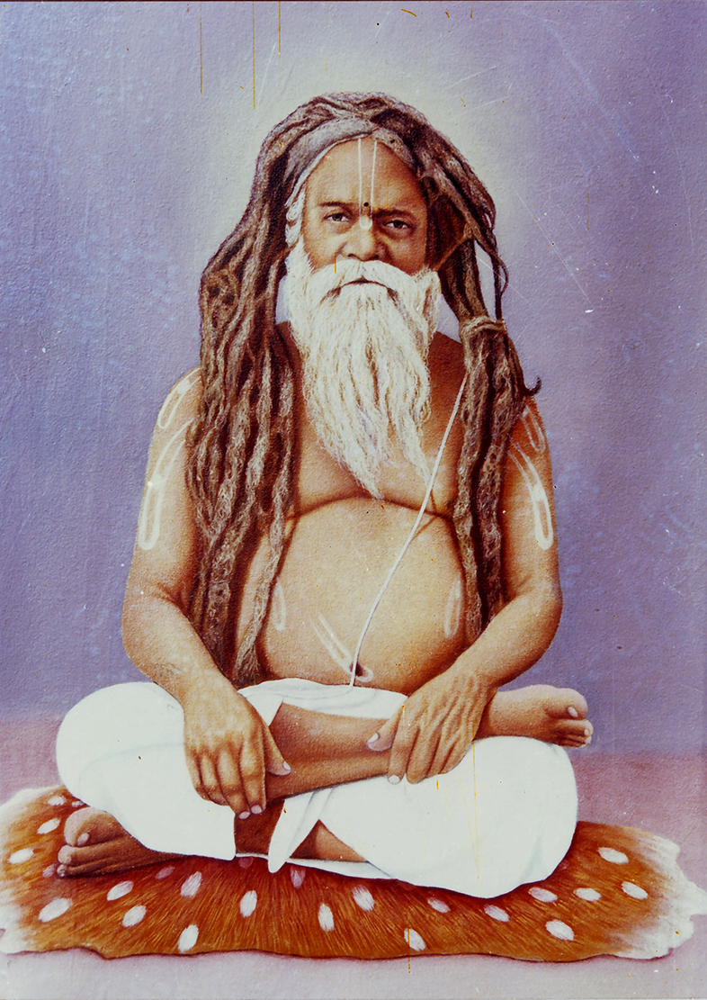

### Swami Santadas Kathiababa Maharaj (55th)(1859 - )
A leading disciple of Sri Sri 108 Ramdas Kathiababa Maharaji. At the place of Jagannath Ghat, Gangotri, the source of the Ganges, floated in front of him and Har-Parvati, who was present in it, visited him. Lord Shankara then gave him a monosyllabic seed mantra and by chanting that mantra he would gain Sadguru - with such an assurance they disappeared. Then the scene of that Gomukh Gangotri in the Himalayas also disappeared. He started chanting that seed mantra with great devotion. In search of a good guru, he went on various pilgrimages and gradually he arrived at the Prayag Kumbh Mela with a friend. Although his interview here was with his future Gurudev Sri Sri Kathia Babaji Maharaj, he was skeptical about whether he would take him seriously. He saw some miracles of Sri Sri Ram Das Kathia Babaji Maharaj, but could not be completely accept it without doubt. Then he went to Vrindavan in the month of Chaitra and this time he was almost disappointed to see his work from very close to Kathia Babaji Maharaj. Far from considering Sri Sri Kathia Babaji Maharaj as a Brahmajna Mahapurusha, Sri Tarakishore Babu considered him to be an ordinary old village saint. But when his miraculous deeds came to mind, he could not understand exactly what was wrong with his decision. With this skeptical mind he returned to Calcutta. One night in Calcutta, when he was sleeping on the roof of his house, he suddenly woke up and sat up. He saw Sri Sri Ramdas Kathia Babaji Maharaj coming towards Akash Marg and in a short time he came down to him on that roof. After that, Kathia Babaji Maharaj gave a mantra in his ear and left again. There was no other doubt in the mind of Sri Tara Kishore Sharma Chowdhury about Sri Sri Kathia Babaji Maharaj. All his hesitations were immediately dispelled and he considered himself fortunate to have taken refuge in the desired Sadguru. Even after being miraculously initiated in this way, he formally took wife's initiation in Vrindavan on the day of Janmashtami in 1894.


-----
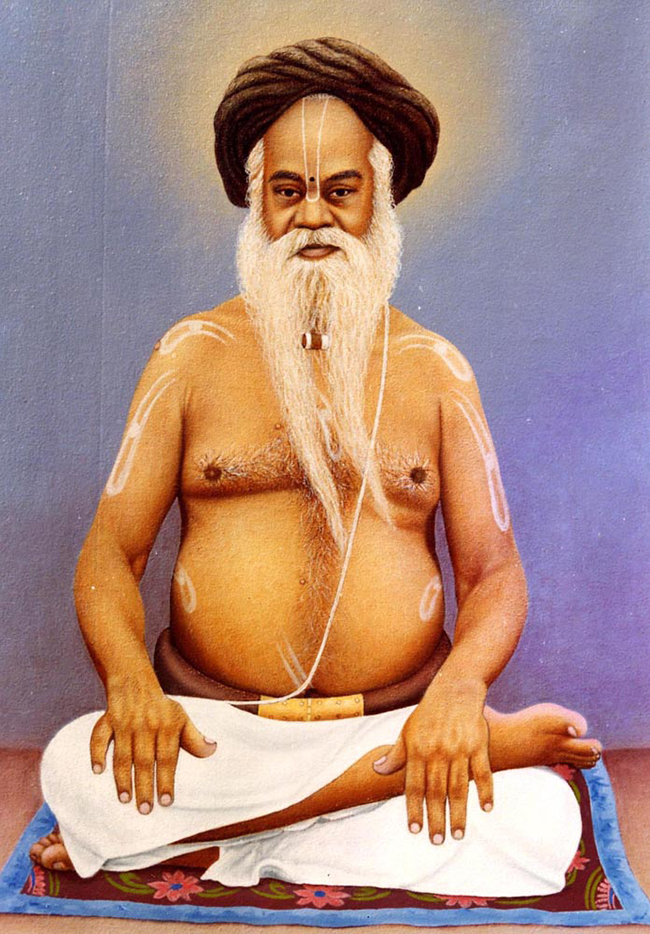

### Swami Dhyananjoy Das Kathia Baba Maharaj(56th)(1901 - 1983)
A leading disciple of Sri Swami Santadas Kathiababa Maharaj.
In India, Mahamuni Vrigu, who was both an ascetic of exceptional
distinction and an astrologer of hitherto insurmountable calibre, kept prepared
various types of horoscopes with his masterly analysis. One such horoscope was
found in Benaras which was exactly similar to what was prepared by the villageastrologer where our Master was born. Thus, the coming of Srimat Swami
Dhananjoydasji Kathia Baba was planned long long before, even thousands of
years ago and his horoscope was kept ready even when nobody could conceive of
his arrival.

In that horoscope, Vrigu had given us the following account of the
Swami’s life:
He will be a holy man whose wisdom will always be guided by religious
tendencies. He would be devoted to Super Conscient and obedient to his superiors.
He would be of religious bent of mind. He would have complete union with the
Super-Conscious, attain all sorts of fulfillment and will be a possessor of third eye.
He will have both transcendental wisdom and vision and will be victorious in all
spheres of his life. He will be a ‘paramahansa’. After leaving this world he will be
in complete union with the Param Brahman.
The life of Sri Sri Babaji Maharaj has fully justified the prophecy of that
ancient sage.

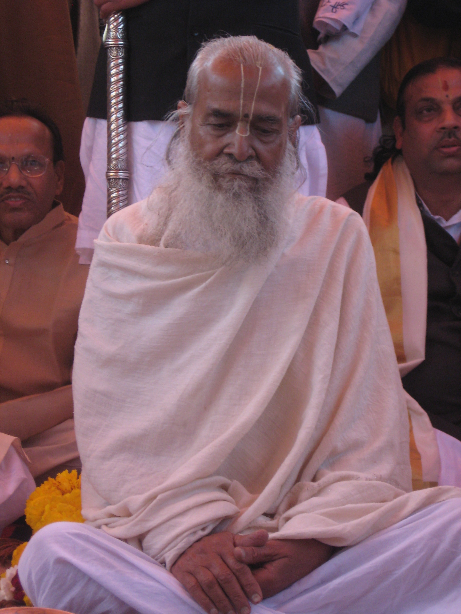

### Shri Radhasarveshwar Sharan Devacharya Shri (Shri Shriji Maharaj (48th)(1921 - 2017)

[Shri Shriji Maharaji - Biography](http://www.shrijagatgurunimbarkacharyapeeth.org/#SHRI_SRIJI_MAHARAJ)

-----
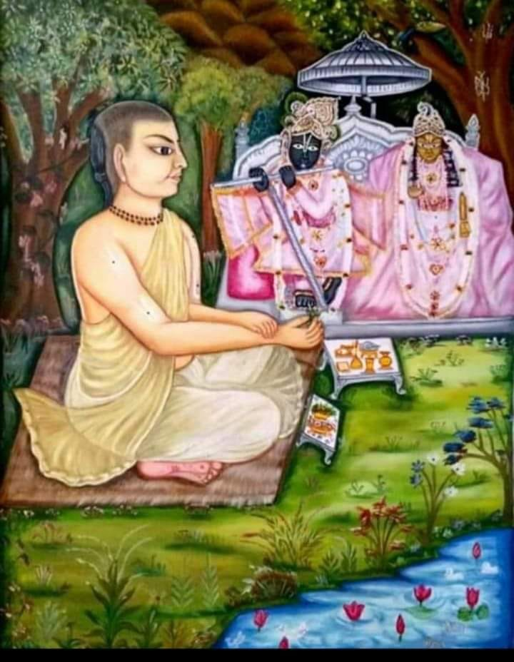

### Shri Jayadev Goswami(48th)

`Sri Jayadev Goswami` who wrote the immaculate sanskrit poem called `Gita Govinda`. Shri Jayadev Goswamis deity is still being worshipped today in the Nimbark Acharya Peeth Mandir, history about the deity can be read here: [gokul chandrama ji](#thakur-shri-madhav-\--gokul-chandrama-ji)


-----
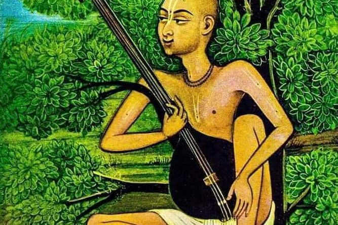

### Swami Haridas

`Swami Haridas` who founded the `Sri Haridas sampraday` is connected to a branch of the Nimbark sampraday that is coming from the 16th Acharya `Sri Devacharyaji`

The two sampradays get along very well and see each other as being apart of the same family.

Though in the writings of Swami Haridas and His close associates do not mention any link to the Nimbark Sampraday. We accept this on the basis of the oral tradition from both the Nimbark and Haridas Sampraday, as all the main acharya's within both sampradays accept this theory and the two sampradays and their acharyas have a very close relationship with each other.

## History
----

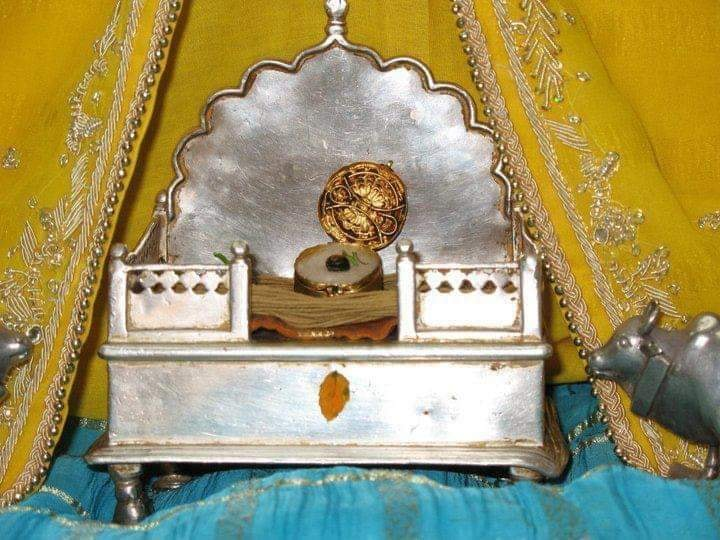

### Shri Sarveshvar Prabu (Radha Krishna Shaligram Shila)

Amongst the main deities at Nimark Acharya peeth, Sarveshwar Prabhu, in the form of a Shaligram is the most auspicious and is one of a kind deity. 

This is a Shaligram deity of Shri Radha Krishna's combined form which has been worshipped for ages by the Sanaka brothes, Narada Muni, Nimbark Bhagavan and all the succeeding Acharyas of the Nimbark Achaya peeth.

Wherever the acharyas proceed Sarveshvar Prabhu is always with the Acharya.


---- 

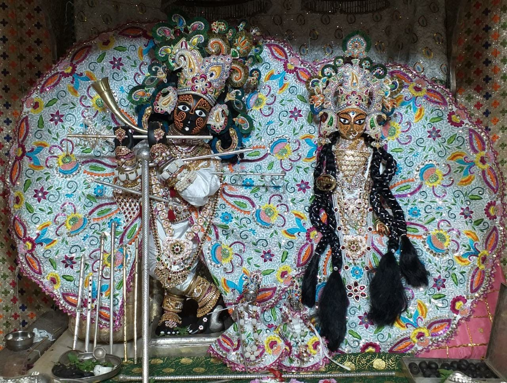

### Thakur Shri Madhav - Gokul Chandrama ji

The deity `Gokul Chandrama ji` is installed at the Nimbarkpeeth and is mentioned in the `Shri Gopal Tapani Upanishad` of the `Atharva Veda` as an ancient deity that caused realisation of the Shri Gopal mantra. It is said that the fortunate few who obtain the darshan of this beautiful deity even once becomes blessed. The deity has also been worshipped by poet laureate `Shri Jayadev` the author of the famous `Gita Govinda`. 

The history of this deity is as follows:

After a few years after the passing away of `Shri Jayadev`, the idol was installed at Shri Nimark Acharya peeth at Shri Radha Kund, Vrindavan. Shri Govind Sharana Devacharya, the then acharya of the Nimark Acharya peeth, received instructions from Shri Radha Madhav to embark on the acharya’s rath (carriage) with the deity to Salemabad, Rajasthan. As instructed the Acharya proceeded on the rath to Salemabad. Enroute at Bharatpur, the entrouge rested for after seva of pulling the rath, the residents of vraj pleaded with the Acharya not to take away the deity to Salemabad and return to return it to braj. The Acharya explained that it is the instructions of Shri Radha Madhav, therefor he is just as helpless as them. The people approached the ruler of Bharatpur, who told the protestors that if they could pull the rath back to braj and if the Lord is willing, then He had no objections. 

Try as they may, the residents of vraj, could not move the rath even one inch. However, after the seva, when the Acharya, pleaded for the rath to move and asked the devotees to pull to the astonishment of all devotees, the rath moved and proceeded to Salemabad, where the deity is curruntly installed in the temple at the centre of the Nimbark Acharya peeth.


### Related articles
- [Origines of the Ras Lila Tradition](https://a108.net/blogs/entry/15339-karhala-village-origin-of-the-raas-lila-tradition/)

- [Ancient Nimbark temple, 350 - 400 years old](https://a108.net/blogs/entry/38005-nimbark-temples-of-chhipi-gali-nimbark-kot-ajab-manohar-lal/)

