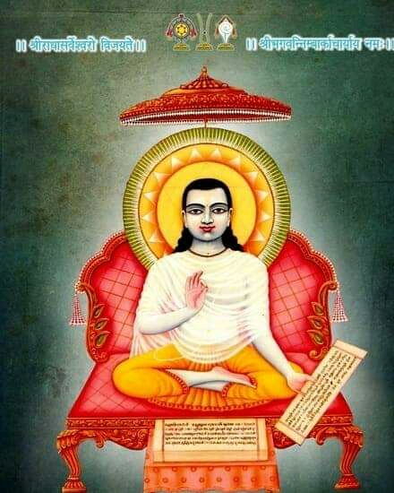
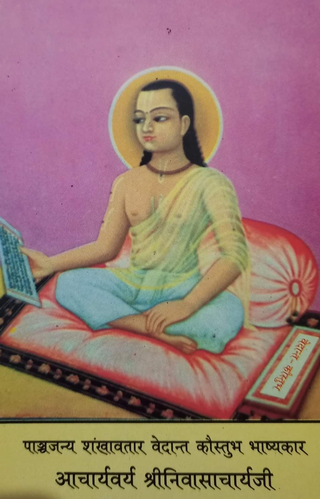
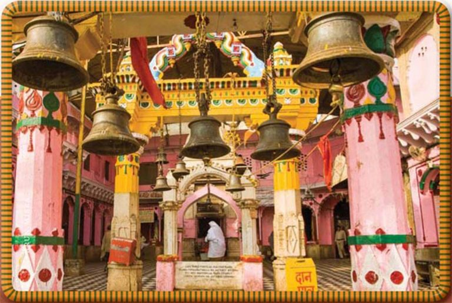
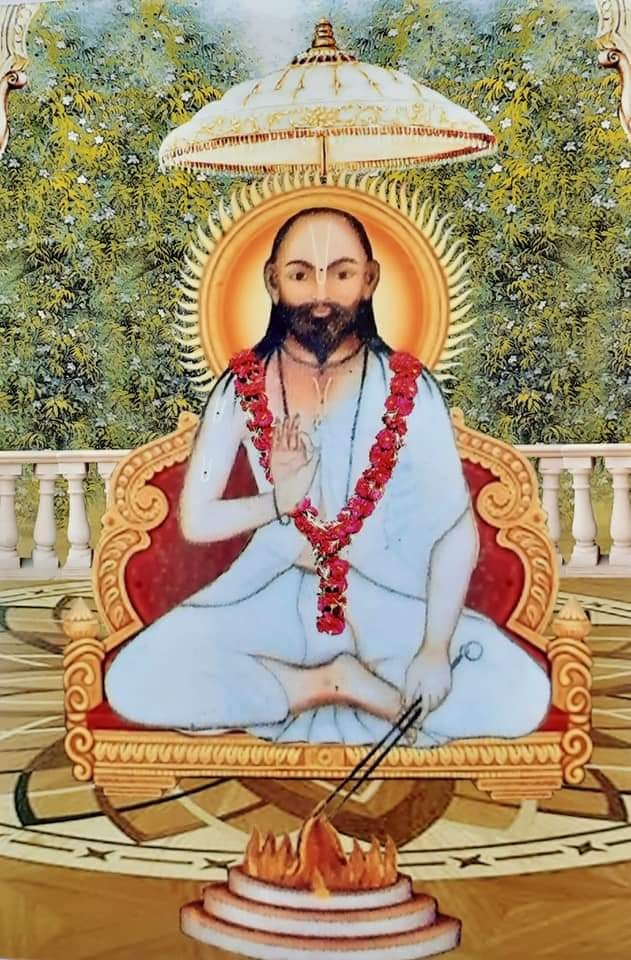
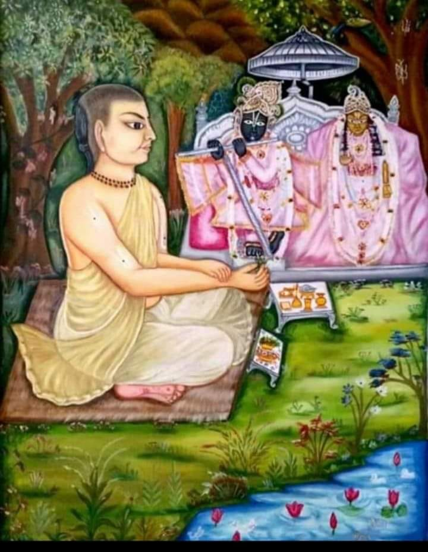
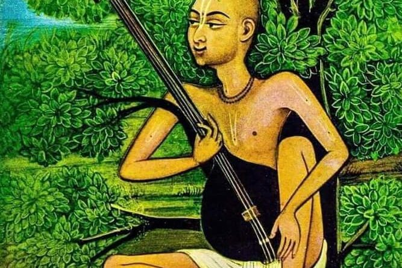

## Acharya's

The amount of Acharyas and Mahants in the sampraday is astounding. These are just most of the historically significant Guru Maharaj's.

----


### Jagad Guru Shri Nimbarkacharya Maharaj (4th) (11 century A.D or 3096 A.D [Disputed])

The Sutras of Maharishi Veda Vyasa form the basis of Vedanta. From the various interpretations of the same, four  main schools of thought emerged. The Keval Advaita of Sri Sankaracharya, the Visishta Advaita of Sri Ramanujacharya, the Dvaita philosophy of Sri Madhavacharya and the Bhedabheda or Dvaitadvaita philosophy of Sri Nimbarkacharya.  However, Sri Nimbarkacharya has been able to reconcile all the other school of thoughts and his Bhashya on the Brahma Sutras appears to pre-date all other Bashyas on the Brahma Sutras.

As there is no reference, comment on the other Bhashyas by Shri Nimbarkacharya.

Sri Nimbark Acharya is also the oldest known acharya to worship Radha along with Krishna in Sakhi Bhava Upasana method of worship.

Sri Nimbarkacharya appeared in different ages. It is mentioned in Acharya Charitra, Naimisha Khanda, Vamana Purana and Bhavishya Purana. Once the devotees prayed to the Lord to protect them and the religious path. Then the Lord told His Sudershan Chakra,

_sudarshana! mahabaho! koti-surya-sama-prabhah
ajnana timirandhanam vishnor margam pradarshaya_

_"O supreme invincible one! Powerful like millions of suns. O My supreme devotee. Show the path of Vishnu, the devotional path, to these people who are suffering in darkness due to ignorance."_

As per the oral tradition and Puranic evidence's, one main sources being the Bhavishya Purana, it is stated that Nimbark Acarya incarnated in the year 3096 A.D and explains more details about the divine appearance of Sri Nimbark Acaryaji.

_Then Sudarshana Chakra decided to take his incarnation by the order of the Lord. He advented himself in the beginning of kali yuga, from today(2022) about 5098 years ago, in the East-South part of India on the bank of the Godavari river near the city of Vaidurya Pattan at Sudarshana Ashrama in the womb of Sadhvi Jayanti Devi, the wife of Aruna Rishi, who was in the dynasty of Bhrigu at dusk during the karttika month, Shukla Purnima. In his childhood he went on a pilgrimage with his parents and reached Vraja mandala. He performed austerities under Goverdhan hill in a village named Nimbagaon and showed the path of devotion to Radha and Krishna. Once Brahma came in the form of a renunciate in order to take the darshan of Sudarshana who was there as a small boy. Sudarshana wanted to give honour to Brahma. He showed him the darshan of Surya from the middle of a neem tree, though it was already sunset. When Brahma understood that the Lord in the form of Surya gave his darshan through a neem tree, he said, "You will be famous by the name of "Nimbarka" and disappeared._


Nimbark Acarya has written the following scriptures and commentaries:
```
- Vedānta Pārijāta Saurabha– Commentary on the Brahma Sutras
- Sadācāra Prakāśa– Commentary on the Bhagavad-Gītā
- Rahasya Ṣoḍaśī- Śrī Gopāla Mantra explained
- Prapanna Kalpa Vallī- Śrī Mukuṇḍa Mantra explained
- Prapatti Cintāmaṇi – On Supreme surrender
- Prātaḥ Smaraṇa Stotram
- Daśa Śloki or Kāmadhenu– Ten Verses
- Saviśeṣa Nirviśeṣa
- Śrī Kṛṣṇa Stavam
```

-----


### Shri Shrinivasacharyaji Maharaj (5th)

Shri Shrinivasacharyaji Maharaj, the foremost disciple of Shri Nimbarkacharya, who wrote a masterly analysis of the Vedanta Parijata Sourabh, composed by his Guru, named `Vedanta Koustubh Bhashya`.

There are many other holy works besides this, of which only `Laghustavaraja` is also well known work. `Parijat Saurabh Bhashya`, `Rahasya Prabandha`, `Kathopanishad Bhashya` etc. are unavailable.

-----
### Shri Purushottamacharyaji (7th)

The `Vedanta Kamadhenu Dashashloki` composed by Shri Nimbarkacharya was further explained by Acharya Shri Purushottamacharyaji, under the name of `Vedanta Ratna Manjusha`, which is one of his well respected works.

-----


### Shri KeshavKashmiri Bhattacharyaji Maharaj (33rd)(Around 1420-1490)

He was renowned scholar through out india and was also known as Digvijay (Who is victorious over everyone) by being victorias in his debates throughout India.

Shri KeshavKashmiri Bhattacharyaji Maharaj elaborated on the `Vedanta Koustubh Bhashya` Sri Nimbark Acharya's commentary on Vedanta Sutras, in His well received work titled, `Prabhavritti` or `Vedanta Kaustubh Prabhavritti`. 

This acharya’s work named `Kramdipika` on Tantra is very famous. Maharaji also wrote a commentary on the Bhagavad Gita titled `Tattva Prakashika`. 

He is also known for defeating the purpose of the YANTRA placed by Yavan Kaji at the Vishram Ghat in Mathura, by using his own Yantra, thus upholding the Hindu Culture and also the Vedic Vaishnava Sampradayas.



Viśhrām Ghāṭ in Vṛindāvan, the headquarters of the Nimbārka Sampradāya from the time of Śhrī Keśhavakāśhmīri Bhaṭṭāchārya (1400’s) until the 1560’s, when Jagadguru Swāmī Paraśhurāma Devāchārya relocated it to Salemabād, Ajmer, in Rajasthan.


-----


### Swami Sri Sribhatta Devāchārya (34th)(Around 1440-1520)

It is said the he was the first-ever author to compose Vāṇī poetry in Braj Bhāṣhā. This Vani is called `Yugala Shataka`. 

-----


### Sri Hari Vyas Dev Acharya (35th)(Around 1470-1540)
One of the most important Acarya's in the sampraday is Sri Hari Vyas Deva Acharyaji. He spread the nimbark sampraday at large with his 12 main disciples.

He too has many texts composed in Sanskrit and Vrajbhasha. Among them `Siddhanta Ratnanjali` in Sanskrit is the most famous. This book is in the form of interpretation of `Vedanta Kamadhenu Dashashloki` by Shri Nimbark Acharya. `Mahavani` is the main text in Vrajbhasha . This rasa is considered the best among the scriptures. This Mahavani is like a great commentary of `Sri Yugal Shatak` by Shri Bhattadevacharyaji. 

[Sri Hari Vyas Dev Acharya Biography](https://www.brajrasik.org/articles/5ef709f8e6bb820063961227/biography-of-shri-harivyas-devacharya) 

-----


### Shri Parashuramdevacharya Ji (36th)(1525-1607)
The anointed Acharya of the Nimbark sampraday by Sri Harivyas Dev Acharya and he established the new Acharya Peeth in Salemabad. 
All the acharays in this line inherent the Shaligram Shila that was originally worshiped by Shri Nimbark Acharya.
This Shaligram Shila is still worskipped and past down the the present day Nimbark sampraday Acharya.

His creation is a huge book called `Parshuram Sagar`. His compositions have been done in many verses like couplets, verses, chaupai, varva, chappay and pad etc. This huge book has been published in four parts. its Editing by scholar Shriramprasad G Sharma M.A. Ph. D. Former spokesperson Government College Kishangarh (Rajasthan) has done it.

----
### Svāmī Svabhūrāma Devācārya (36th)(Around early 16th century)
Svāmī Svabhūrāma Devācārya (fl.16th century CE) was born in Budhiya Village, outside Jagadhri and Yamunanagar near Kurukshetra in modern Haryana, India. He established over 52 temples in Punjab, Haryana and Vraja during his lifetime; his current followers are found mostly in Vṛndāvana, Haryana, Punjab, Bengal, Rajasthan, Orissa, Assam, Sikkim, Bihar, other regions in Uttar Pradesh and Maharashtra, also in significant numbers in Nepal.

-----
### Sri Chatur Chintamani Devacharya (Nagaji Maharaj)(39th)
Sri Nagaji Maharaji is famed as the initiator of the famous Braja 84 Kos Parikrama Yatra. By virtue of unflinching spiritual penances and practices Chatura Chintamani Maharaj possessed such spiritual powers that He would do the circumambulation of the Braja 84 Kos (approx. 300km) in a day which a normal devotee takes around 42 days. But, even after years of resolved spiritual penances The Divine vision of the Yugal Sarkar eluded Nagaji. Once Nagaji was so frustrated with Bhagwan for not revealing himself that he started to walk away from Vrindaban with an intension of leaving Brajadham forever. But while Chatura Chintamani ji started to walk off from His perch, His “Jata”, long locks got entangled in the bushy thorns. He could not move a bit and was stuck there for three night and three days without food and shelter, but with firm faith that Lord will come down to rescue. Lord too was testing His devotee’s fortitude. However, Radharani , the ever compassionate mother could not bear the sight anymore and appeared to Nagaji along with Lord. She brought food and sweet milk for her devotee and fed it herself to him just like a mother. Together the divine couple detangled the locks from the thorny shrubs and fulfilled Nagaji’s long cherished wish. This lila of Bhakt and Bhagwan has been highly gloried in the whole of Vaishnava community till date.


-----


### Yogiraj Swami Ramdas Kathia Baba Maharaj (54th)(1800 – 1909)

Yogiraj Swami Ramdas Kathia Baba Maharaj, was a self-realised saint who personified supreme devotion and wisdom. He would revel in the divine vison of the Yugal Sarkar every moment, but his outward eccentric attitude and childlike demeanour would never reveal His greatness. Lucky few could fathom the depth of His spiritual splendour by solely His grace. He was highy revered in the Vaishnava community and Sadhu samaj as a whole and was bestowed with the title of Brajabidehi, Chatur Sampraday Mahant. It is said that after Sri Kathia Baba left his mortal body, tears flowed continuously for 13 days from the stone idol of Srimati Radharani ji. It was so bad that the stone eyes of the idol had to be replaced with a new pair.


-----


### Swami Santadas Kathiababa Maharaj (55th)(1859 - )
A leading disciple of Sri Sri 108 Ramdas Kathiababa Maharaji. At the place of Jagannath Ghat, Gangotri, the source of the Ganges, floated in front of him and Har-Parvati, who was present in it, visited him. Lord Shankara then gave him a monosyllabic seed mantra and by chanting that mantra he would gain Sadguru - with such an assurance they disappeared. Then the scene of that Gomukh Gangotri in the Himalayas also disappeared. He started chanting that seed mantra with great devotion. In search of a good guru, he went on various pilgrimages and gradually he arrived at the Prayag Kumbh Mela with a friend. Although his interview here was with his future Gurudev Sri Sri Kathia Babaji Maharaj, he was skeptical about whether he would take him seriously. He saw some miracles of Sri Sri Ram Das Kathia Babaji Maharaj, but could not be completely accept it without doubt. Then he went to Vrindavan in the month of Chaitra and this time he was almost disappointed to see his work from very close to Kathia Babaji Maharaj. Far from considering Sri Sri Kathia Babaji Maharaj as a Brahmajna Mahapurusha, Sri Tarakishore Babu considered him to be an ordinary old village saint. But when his miraculous deeds came to mind, he could not understand exactly what was wrong with his decision. With this skeptical mind he returned to Calcutta. One night in Calcutta, when he was sleeping on the roof of his house, he suddenly woke up and sat up. He saw Sri Sri Ramdas Kathia Babaji Maharaj coming towards Akash Marg and in a short time he came down to him on that roof. After that, Kathia Babaji Maharaj gave a mantra in his ear and left again. There was no other doubt in the mind of Sri Tara Kishore Sharma Chowdhury about Sri Sri Kathia Babaji Maharaj. All his hesitations were immediately dispelled and he considered himself fortunate to have taken refuge in the desired Sadguru. Even after being miraculously initiated in this way, he formally took wife's initiation in Vrindavan on the day of Janmashtami in 1894.


-----


### Swami Dhyananjoy Das Kathia Baba Maharaj(56th)(1901 - 1983)
A leading disciple of Sri Swami Santadas Kathiababa Maharaj.
In India, Mahamuni Vrigu, who was both an ascetic of exceptional
distinction and an astrologer of hitherto insurmountable calibre, kept prepared
various types of horoscopes with his masterly analysis. One such horoscope was
found in Benaras which was exactly similar to what was prepared by the villageastrologer where our Master was born. Thus, the coming of Srimat Swami
Dhananjoydasji Kathia Baba was planned long long before, even thousands of
years ago and his horoscope was kept ready even when nobody could conceive of
his arrival.

In that horoscope, Vrigu had given us the following account of the
Swami’s life:
He will be a holy man whose wisdom will always be guided by religious
tendencies. He would be devoted to Super Conscient and obedient to his superiors.
He would be of religious bent of mind. He would have complete union with the
Super-Conscious, attain all sorts of fulfillment and will be a possessor of third eye.
He will have both transcendental wisdom and vision and will be victorious in all
spheres of his life. He will be a ‘paramahansa’. After leaving this world he will be
in complete union with the Param Brahman.
The life of Sri Sri Babaji Maharaj has fully justified the prophecy of that
ancient sage.


### Shri Radhasarveshwar Sharan Devacharya Shri (Shri Shriji Maharaj (48th)(1921 - 2017)

[Shri Shriji Maharaji - Biography](http://www.shrijagatgurunimbarkacharyapeeth.org/#SHRI_SRIJI_MAHARAJ)

-----


### Shri Jayadev Goswami(48th)

`Sri Jayadev Goswami` who wrote the immaculate sanskrit poem called `Gita Govinda`.

-----


### Swami Haridas
`Swami Haridas` who founded the `Sri Haridas sampraday` is connected to a branch of the Nimbark sampraday that is coming from the 16th Acharya `Sri Devacharyaji`

*Edit*
Though in the writings of Swami Haridas and His close associates do not mention any link to the Nimbark Sampraday. We accept this on the basis of the oral tradition from both the Nimbark and Haridas Sampraday, as all the main acharya's within both sampradays accept this theory and the two sampradays and their acharyas have a very close relationship with each other.


Gori Lal 

Found in Nidivan,
Rasik Bihari
Rasik Bihari Ji